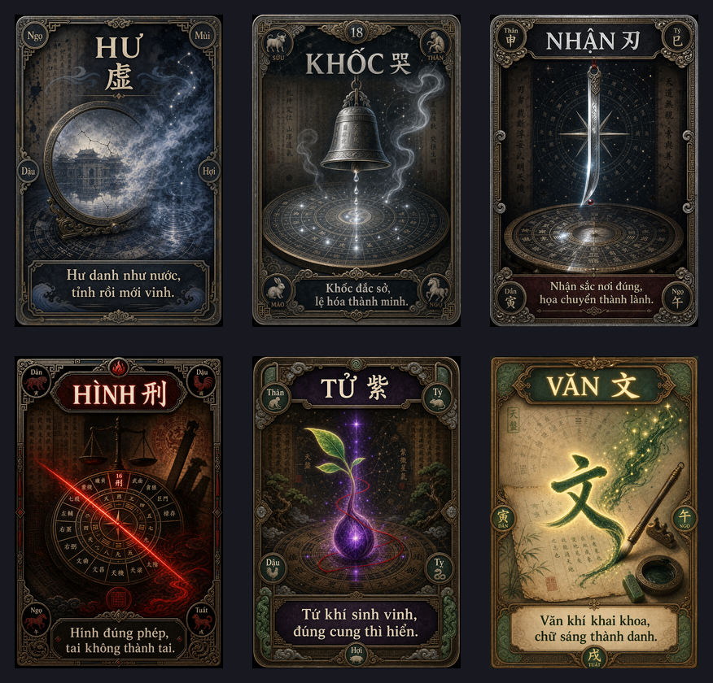
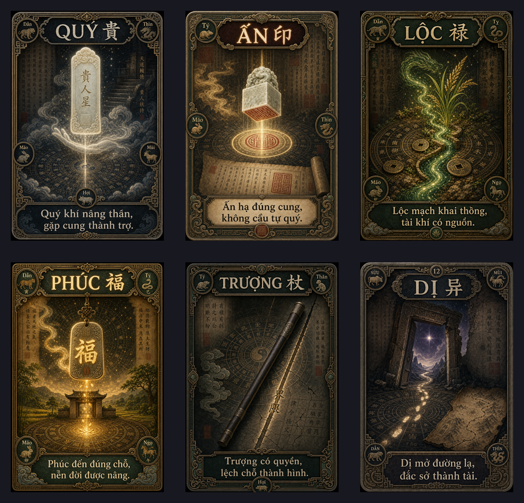
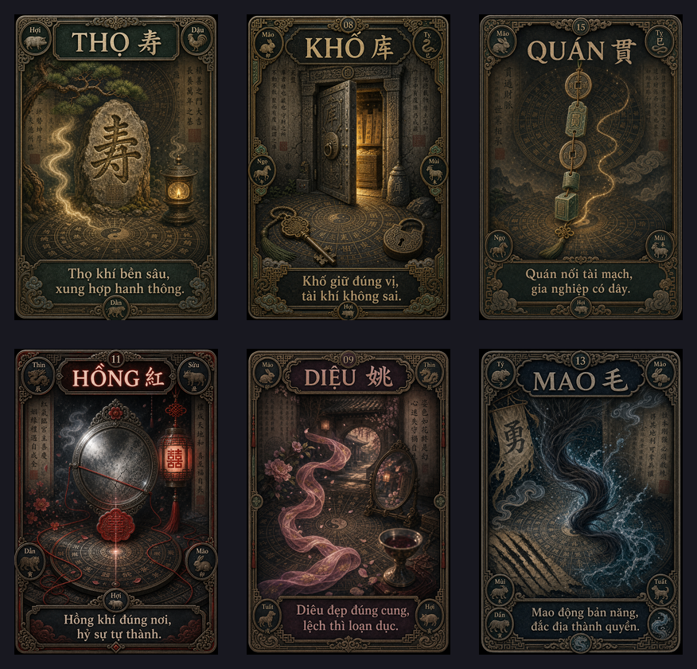

# Image Wiki — Chiếu Đởm Kinh / 18 Phi Tinh

Ngày cập nhật: 2026-05-22

Wiki này ghi nhận ảnh đã vẽ, prompt nguồn, trạng thái QA và đường dẫn web-ready cho bộ **Chiếu Đởm Kinh / 18 Phi Tinh**.

## Batch 1 — Định Hình Trường Phái

Contact sheet QA:

| ID | Tên | Prompt | Ảnh gốc | Web-ready | QA |
|---|---|---|---|---|---|
| `cdk_phi_14_hu` | Hư 虚 | `prompts/cdk_phi_14_hu.prompt.md` | `generated_cards/cdk_phi_14_hu__xu__am_thuy.png` | `web_ready/cdk_phi_14_hu.webp` | Đạt: pháp tượng gương nứt, cung điện phản chiếu, thủy khí lạnh; không horror. |
| `cdk_phi_18_khoc` | Khốc 哭 | `prompts/cdk_phi_18_khoc.prompt.md` | `generated_cards/cdk_phi_18_khoc__ku__am_kim.png` | `web_ready/cdk_phi_18_khoc.webp` | Đạt: chuông nghi lễ, lệ bạc, chuyển hóa bi thương; không tang lễ nặng. |
| `cdk_phi_17_nhan` | Nhận 刃 | `prompts/cdk_phi_17_nhan.prompt.md` | `generated_cards/cdk_phi_17_nhan__ren__am_kim.png` | `web_ready/cdk_phi_17_nhan.webp` | Đạt: lưỡi/edge là trung tâm, không thành chiến binh Kình Dương. |
| `cdk_phi_16_hinh` | Hình 刑 | `prompts/cdk_phi_16_hinh.prompt.md` | `generated_cards/cdk_phi_16_hinh__xing__am_hoa.png` | `web_ready/cdk_phi_16_hinh.webp` | Đạt: pháp luật/hệ quả qua vạch đỏ, thiên bàn và cân; không bạo lực. |
| `cdk_phi_01_tu` | Tử 紫 | `prompts/cdk_phi_01_tu.prompt.md` | `generated_cards/cdk_phi_01_tu__zi__duong_moc.png` | `web_ready/cdk_phi_01_tu.webp` | Đạt: mầm tử khí, sao tím, chỉ đỏ; không hoàng đế/ngai vàng. |
| `cdk_phi_02_van` | Văn 文 | `prompts/cdk_phi_02_van.prompt.md` | `generated_cards/cdk_phi_02_van__wen__duong_moc.png` | `web_ready/cdk_phi_02_van.webp` | Đạt: văn khí, chữ phát sáng, bút/mực; không thành Xương Khúc song nhân. |

## Batch 2 — Cát/Hung Cân Bằng

Contact sheet QA:

| ID | Tên | Prompt | Ảnh gốc | Web-ready | QA |
|---|---|---|---|---|---|
| `cdk_phi_10_quy` | Quý 贵 | `prompts/cdk_phi_10_quy.prompt.md` | `generated_cards/cdk_phi_10_quy__gui__am_tho.png` | `web_ready/cdk_phi_10_quy.webp` | Đạt: ngọc bài quý nhân, khí nâng đỡ, không thành chân dung quý nhân Bắc Phái. |
| `cdk_phi_05_an` | Ấn 印 | `prompts/cdk_phi_05_an.prompt.md` | `generated_cards/cdk_phi_05_an__yin__duong_tho.png` | `web_ready/cdk_phi_05_an.webp` | Đạt: ấn ngọc hạ xuống thiên bàn, quyền lệnh/ủy nhiệm rõ, không hoàng đế. |
| `cdk_phi_04_loc` | Lộc 禄 | `prompts/cdk_phi_04_loc.prompt.md` | `generated_cards/cdk_phi_04_loc__lu__duong_moc.png` | `web_ready/cdk_phi_04_loc.webp` | Đạt: dòng lộc/mạch tài nguyên, không thành Lộc Tồn giữ kho. |
| `cdk_phi_03_phuc` | Phúc 福 | `prompts/cdk_phi_03_phuc.prompt.md` | `generated_cards/cdk_phi_03_phuc__fu__duong_tho.png` | `web_ready/cdk_phi_03_phuc.webp` | Đạt: phù phúc và nền đất sáng, không thành ông Phúc dân gian. |
| `cdk_phi_07_truong` | Trượng 杖 | `prompts/cdk_phi_07_truong.prompt.md` | `generated_cards/cdk_phi_07_truong__zhang__duong_moc.png` | `web_ready/cdk_phi_07_truong.webp` | Đạt: quyền trượng/đường ranh/pháp lệ, không thành pháp sư hay vũ khí chiến đấu. |
| `cdk_phi_12_di` | Dị 异 | `prompts/cdk_phi_12_di.prompt.md` | `generated_cards/cdk_phi_12_di__yi__am_tho.png` | `web_ready/cdk_phi_12_di.webp` | Đạt: cửa lạ, đường khác, bản đồ rách; không dị dạng/horror. |

## Batch 3 — Hoàn Thiện Bộ

Contact sheet QA:

| ID | Tên | Prompt | Ảnh gốc | Web-ready | QA |
|---|---|---|---|---|---|
| `cdk_phi_06_tho` | Thọ 寿 | `prompts/cdk_phi_06_tho.prompt.md` | `generated_cards/cdk_phi_06_tho__shou__duong_tho.png` | `web_ready/cdk_phi_06_tho.webp` | Đạt: đá Thọ, tùng và đèn thọ; không thành Thiên Lương/hiền sư. |
| `cdk_phi_08_kho` | Khố 库 | `prompts/cdk_phi_08_kho.prompt.md` | `generated_cards/cdk_phi_08_kho__ku__duong_tho.png` | `web_ready/cdk_phi_08_kho.webp` | Đạt: kho đá mở nửa cửa, chìa khóa và tài khố; không thành Lộc Tồn. |
| `cdk_phi_15_quan` | Quán 贯 | `prompts/cdk_phi_15_quan.prompt.md` | `generated_cards/cdk_phi_15_quan__guan__am_tho.png` | `web_ready/cdk_phi_15_quan.webp` | Mỹ thuật đạt: dây xuyên tiền/ngọc ấn. Chữ Hán trên ảnh cần overlay lại khi production để đảm bảo đúng `贯`. |
| `cdk_phi_11_hong` | Hồng 红 | `prompts/cdk_phi_11_hong.prompt.md` | `generated_cards/cdk_phi_11_hong__hong__am_kim.png` | `web_ready/cdk_phi_11_hong.webp` | Đạt: chỉ đỏ/gương bạc/lễ nghi, không thành tranh tình duyên lộ liễu. |
| `cdk_phi_09_dieu` | Diêu 姚 | `prompts/cdk_phi_09_dieu.prompt.md` | `generated_cards/cdk_phi_09_dieu__yao__duong_tho.png` | `web_ready/cdk_phi_09_dieu.webp` | Đạt: lụa, hoa, gương, chén; quyến rũ tiết chế, không tục. |
| `cdk_phi_13_mao` | Mao 毛 | `prompts/cdk_phi_13_mao.prompt.md` | `generated_cards/cdk_phi_13_mao__mao__am_thuy.png` | `web_ready/cdk_phi_13_mao.webp` | Đạt: lông/tóc hóa thủy khí và bản năng; không thành quái vật. |

## QA Chung

- 18/18 thẻ đã có ảnh gốc và web-ready.
- Ảnh gốc đa số PNG 1024 x 1536, tỷ lệ 2:3; một vài output lệch 1px do model nhưng đã chuẩn hóa ở bản web-ready.
- Tất cả ảnh web-ready: WebP 768 x 1152, quality 88.
- Phong cách đã tách khỏi Tử Vi Bắc Phái: trọng pháp tượng/ký hiệu sống hơn nhân vật.
- Chữ chính trên thẻ nhìn được ở contact sheet. Nếu cần bản production tuyệt đối chuẩn chữ, nên làm thêm bước overlay text bằng layout cố định thay vì phụ thuộc chữ sinh từ image model.
