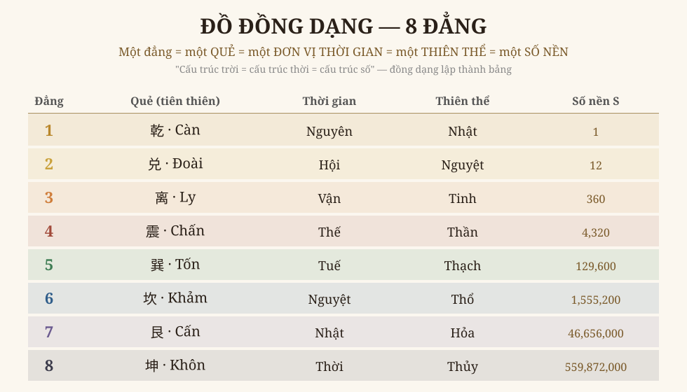
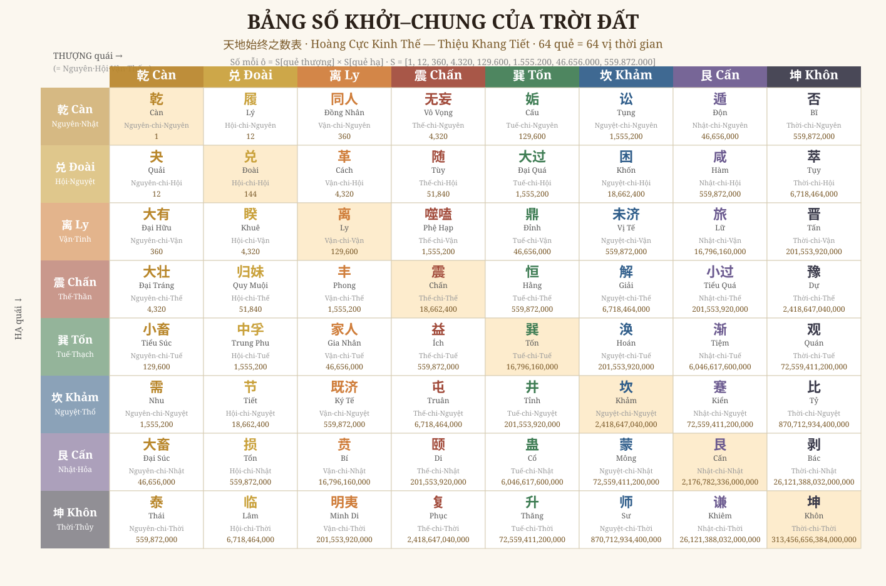

# Chương 1 — Bảng Số Khởi–Chung Của Trời Đất
### 天地始终之数表 · Hệ số 元会运世 của Hoàng Cực Kinh Thế

> *Phục dựng từ bản 皇极经世书今说 (Diêm Tu Triện tập thuyết) — tr.230–234.*
> *Đọc → hiểu → vẽ lại → biên sách. Đồng tác giả: Anh Thắng + trợ thủ.*

---

## 1. Bảng này là gì

Sau mười vòng đọc Quan Vật Nội Thiên (phần **lời giảng**), ta tới phần **cốt tử** của bộ sách: bảng số. Đây không phải bảng tra khô — đây là **toàn bộ vũ trụ quan của Thiệu Ung lập thành một lưới**.

Một câu để nhớ: **mỗi quẻ trong 64 quẻ = một lát cắt thời gian của vũ trụ = một thiên thể = một con số xác định.** Bốn cách gọi tên, cùng chỉ MỘT thứ. Đó là "đồng dạng" (cấu trúc trời = cấu trúc thời = cấu trúc số) — thứ mà phần Nội Thiên chỉ *giảng bằng lời*, ở đây *hiện thành con số đếm được*.

## 2. Tám đẳng — xương sống của cả hệ

Vũ trụ Hoàng Cực chia làm **8 đẳng (rank)**. Mỗi đẳng mang đồng thời bốn danh tính:

| Đẳng | Quẻ (tiên thiên) | Thời gian | Thiên thể | Số nền **S** |
|---|---|---|---|---|
| 1 | 乾 Càn | Nguyên (元) | Nhật (日) | 1 |
| 2 | 兑 Đoài | Hội (会) | Nguyệt (月) | 12 |
| 3 | 离 Ly | Vận (运) | Tinh (星) | 360 |
| 4 | 震 Chấn | Thế (世) | Thần (辰) | 4.320 |
| 5 | 巽 Tốn | Tuế (岁) | Thạch (石) | 129.600 |
| 6 | 坎 Khảm | Nguyệt-tháng (月) | Thổ (土) | 1.555.200 |
| 7 | 艮 Cấn | Nhật-ngày (日) | Hỏa (火) | 46.656.000 |
| 8 | 坤 Khôn | Thời (时) | Thủy (水) | 559.872.000 |

**Số nền sinh ra sao:** khởi từ **1**, rồi nhân **luân phiên ×12 và ×30** —
1 ×12→ 12 ×30→ 360 ×12→ 4.320 ×30→ 129.600 ×12→ 1.555.200 ×30→ 46.656.000 ×12→ 559.872.000.

Vì sao 12 và 30 đan nhau? Vì đó là nhịp của lịch: **1 nguyên = 12 hội · 1 hội = 30 vận · 1 vận = 12 thế · 1 thế = 30 tuế…** — cứ một tầng "mười hai" lại tới một tầng "ba mươi", y như tháng (12/năm) và ngày (30/tháng) đan nhau. Con số **129.600** (đẳng 5) chính là **số năm của 1 Nguyên** — chu kỳ lớn trứ danh của Thiệu Ung.

## 3. Quy luật sinh 64 ô (chỗ "hiểu" sâu nhất)

64 quẻ = **8 quẻ THƯỢNG × 8 quẻ HẠ** (phương đồ Phục Hy). Một ô ở giao điểm (thượng = đẳng *a*, hạ = đẳng *b*) được định nghĩa trọn vẹn:

- **Quẻ** = quẻ thượng chồng quẻ hạ (vd Thượng Càn + Hạ Đoài = quẻ **Quải**).
- **Danh thời gian** = `(thời của a) chi (thời của b)` — vd *Nguyên chi Hội*.
- **Danh thiên thể** = `(thể của a) chi (thể của b)` — vd *Nhật chi Nguyệt*.
- **CON SỐ = S[a] × S[b].**

Chính công thức **S[a]×S[b]** là chìa khóa. Kiểm chứng:
- Ly-chi-Ly (Vận×Vận) = 360 × 360 = **129.600** ✓ (sách: 离 一十二万九千六百)
- Minh Di = Ly-chi-Khôn (Vận×Thời) = 360 × 559.872.000 = **201.553.920.000** ✓ (sách: 二千零一十五亿五千三百九十二万)
- Khôn-chi-Khôn (Thời×Thời) = 559.872.000² = **313.456.656.384.000.000** — số tột cùng, chu kỳ đóng của vũ trụ.

> Ta không *chép* bảng — ta *tái sinh* nó từ nguyên lý, rồi đối chiếu từng ô với ảnh gốc (qwen-VL đọc). Khớp. **Hiểu được luật sinh tức là hiểu được bảng.**

## 4. Toàn bảng 64 ô — vẽ lại

Đọc bảng: chọn một quẻ THƯỢNG (cột) và một quẻ HẠ (hàng) → ô giao là quẻ tương ứng, kèm danh thời gian và con số. Đường chéo (Càn-Càn, Đoài-Đoài… Khôn-Khôn) là 8 quẻ "thuần" — các mốc Nguyên/Hội/Vận/Thế thuần khiết.

## 5. Ý nghĩa — vì sao bảng này quan trọng

1. **Nó là bản đồ thời gian vũ trụ.** Đặt một năm lịch sử vào lưới → biết năm đó thuộc Hội nào, Vận nào, mang tượng quẻ gì. Tính chất quẻ đó *mô tả khí của thời đại* (vd hội Ngọ = quẻ Cấu, "một âm sinh giữa cực thịnh").
2. **Nó là nguồn của danh tiếng "tiên tri vạn năm".** Thiệu Ung gắn sử thật (Nghiêu, nhà Chu, Bình Vương…) vào từng ô — biến bảng số thành mô hình trị-loạn xuyên 129.600 năm.
3. **Nó là đồng dạng thuần túy.** Quẻ ≡ thời ≡ thể ≡ số. Đây chính là tự-mô-tả của paradigm "đọc đồng dạng" (Iron Rule #4/#6): không bói cát hung, mà đọc *cấu trúc* lặp lại ở mọi tầng — từ một giờ tới một Nguyên.

---

*Chương 1 dựng xong. Bảng số khởi-chung — bộ khung của cả Hoàng Cực — đã được đọc, hiểu (giải mã luật sinh), và vẽ lại (2 đồ + generator tái sinh được 64 ô). Các chương sau: Biến Hóa Đồ (经世变化图), Lịch sử gắn vận-thế, hệ Luật-Lữ Thanh Âm.*
