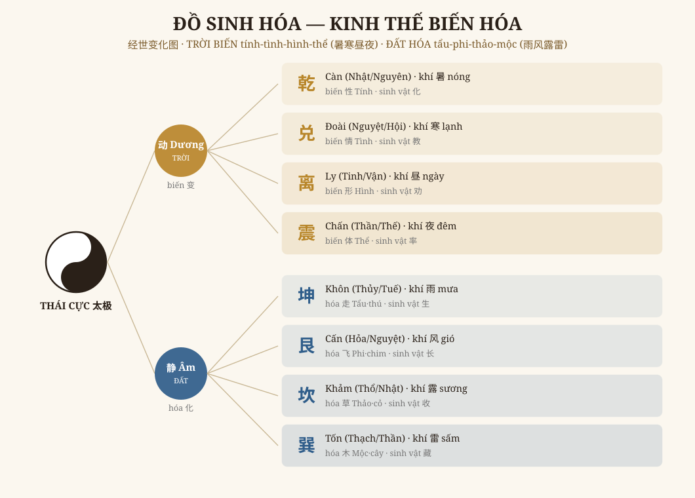
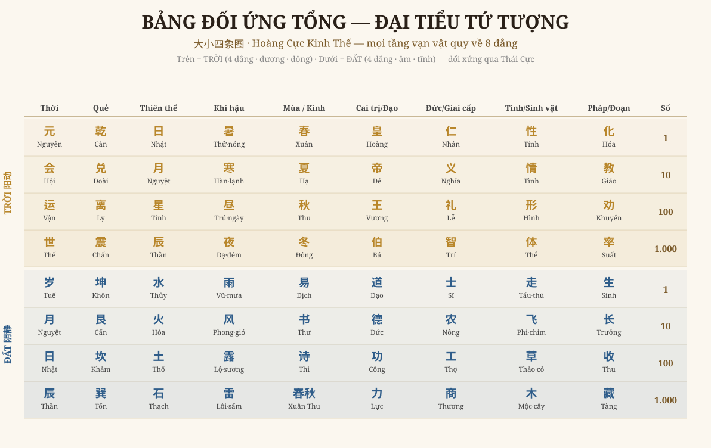

# Chương 2 — Đồ Sinh Hóa & Bảng Đối Ứng Tổng
### 经世变化图 + 大小四象图 · Cơ chế BIẾN–HÓA và mạng đồng dạng của vạn vật

> *Phục dựng từ tr.262–264 bản 皇极经世书今说. Đọc → hiểu → vẽ lại.*

---

## 1. Hai đồ, một mạch

Chương 1 cho ta **lưới SỐ** (64 ô = quẻ × thời gian). Chương này trả lời câu hỏi sâu hơn: **vũ trụ ấy VẬN HÀNH thế nào, và vạn vật quy về đâu?** Hai đồ:

- **经世变化图 (Đồ sinh hóa)** — cơ chế: Thái Cực phân thành Trời/Đất, mỗi bên 4 đẳng, **Trời BIẾN, Đất HÓA** ra vạn vật.
- **大小四象图 (Đồ đại tiểu tứ tượng)** — bảng đối ứng tổng: 8 đẳng × 10 tầng (thời gian, quẻ, thiên thể, khí hậu, mùa/kinh, chính trị, đạo đức, sinh vật, giai đoạn, số).

## 2. Cơ chế BIẾN–HÓA (经世变化图)

Thái Cực → hai nghi:
- **TRỜI** (động · dương): bốn thiên thể **Nhật Nguyệt Tinh Thần** hiện thành khí hậu **Thử–Hàn–Trú–Dạ** (nóng–lạnh–ngày–đêm). Trời **BIẾN** (变) cái *bên trong* của vạn vật: **Tính–Tình–Hình–Thể**.
  - *Thử biến TÍNH · Hàn biến TÌNH · Trú biến HÌNH · Dạ biến THỂ* (tr.264, Bá Ôn)
- **ĐẤT** (tĩnh · âm): bốn thể đất **Thủy Hỏa Thổ Thạch** hiện thành thời tiết **Vũ–Phong–Lộ–Lôi** (mưa–gió–sương–sấm). Đất **HÓA** (化) cái *bên ngoài* — các loài: **Tẩu–Phi–Thảo–Mộc** (thú–chim–cỏ–cây).
  - *Lôi hóa TẨU · Lộ hóa PHI · Phong hóa THẢO · Vũ hóa MỘC*

Một câu cốt: **Trời tác động vào BẢN CHẤT (biến), Đất tác động vào HÌNH HÀI (hóa).** Vạn vật là kết quả giao nhau của hai dòng này — đúng tinh thần "động tĩnh giao mà sinh vạn vật" đã gặp ở Nội Thiên (vòng 4).

## 3. Bảng đối ứng tổng (大小四象图) — mạng đồng dạng đầy đủ

Đây là **bảng đồng dạng giàu nhất** của cả bộ sách — mỗi đẳng nối liền **mười** lĩnh vực:

**TRỜI (4 đẳng · dương · động):**
| Thời | Quẻ | Thể | Khí | Mùa | Cai trị | Đức | Tính | Pháp | Số |
|---|---|---|---|---|---|---|---|---|---|
| Nguyên | Càn | Nhật | Thử | Xuân | Hoàng | Nhân | Tính | Hóa | 1 |
| Hội | Đoài | Nguyệt | Hàn | Hạ | Đế | Nghĩa | Tình | Giáo | 10 |
| Vận | Ly | Tinh | Trú | Thu | Vương | Lễ | Hình | Khuyến | 100 |
| Thế | Chấn | Thần | Dạ | Đông | Bá | Trí | Thể | Suất | 1.000 |

**ĐẤT (4 đẳng · âm · tĩnh):**
| Thời | Quẻ | Thể | Khí | Kinh | Đạo | Giai cấp | Sinh vật | Đoạn | Số |
|---|---|---|---|---|---|---|---|---|---|
| Tuế | Khôn | Thủy | Vũ | Dịch | Đạo | Sĩ | Tẩu | Sinh | 1 |
| Nguyệt | Cấn | Hỏa | Phong | Thư | Đức | Nông | Phi | Trưởng | 10 |
| Nhật | Khảm | Thổ | Lộ | Thi | Công | Công(thợ) | Thảo | Thu | 100 |
| Thần | Tốn | Thạch | Lôi | Xuân Thu | Lực | Thương | Mộc | Tàng | 1.000 |

Đọc theo HÀNG: *"Nguyên = Càn = Nhật = Thử = Xuân = Hoàng = Nhân = Tính = Hóa = 1"* — chín cách gọi, một đẳng. Đọc theo CỘT: mỗi cột là một trật tự tứ-phân quen thuộc (mùa, đức Nhân-Nghĩa-Lễ-Trí, cai trị Hoàng-Đế-Vương-Bá, Tứ Kinh, Sĩ-Nông-Công-Thương…). **Tất cả là CÙNG MỘT bộ khung 4×2 = 8.**

## 4. Vì sao gọi "ĐẠI TIỂU tứ tượng"

Để ý cột Số ở đây là **1 · 10 · 100 · 1.000** (lũy thừa 10) — khác cột số chương 1 là **1 · 12 · 360 · 4.320** (hệ 经世). Đó là lý do tên đồ:
- **ĐẠI số (大)** = hệ Nguyên-Hội-Vận-Thế ×12/×30 (chương 1) — đo **thời gian vũ trụ thực**.
- **TIỂU số (小)** = hệ thập phân 1·10·100·1.000 — đo **thứ bậc/loại** (bao nhiêu hạng).

Hai hệ số là hai cách đếm cùng một cấu trúc 8 đẳng: một bên đếm *trường độ thời gian*, một bên đếm *số lượng phẩm loại*. Chương 1 và chương 2 vì thế là **hai mặt của một đồng tiền**.

## 5. Ý nghĩa

1. **Đây là "bản đồ tổng" để đọc bất cứ thứ gì.** Gặp một mùa, một hạng người, một loài, một thời đoạn — đều tra ngược về được đẳng/quẻ của nó, rồi liên thông sang mọi lĩnh vực khác. Đó là sức mạnh của đồng dạng: biết một góc, suy ra toàn cục.
2. **Biến/Hóa là động cơ.** Không có bảng tĩnh suông — Trời biến bản chất, Đất hóa hình hài, vạn vật sinh ra ở chỗ giao. Đây là phần "động" bổ cho phần "tĩnh" (lưới số) của chương 1.
3. **Khớp đúng paradigm hệ YI-CHRONOS.** Bảng này chính là điều engine `hoang_cuc` và hệ atomization đang làm: nối mọi tầng tri thức về một bộ khung chung để "dùng mắt-tai của thiên hạ làm của mình" (quan-vật-tập-thể, vòng 10).

---

*Chương 2 dựng xong: 2 đồ (sinh hóa + đối ứng tổng) đọc–hiểu–vẽ lại, nối liền với lưới số chương 1 thành "đại–tiểu" một thể. Chương sau: lịch sử gắn vận-thế (mô hình trị-loạn vạn năm).*
