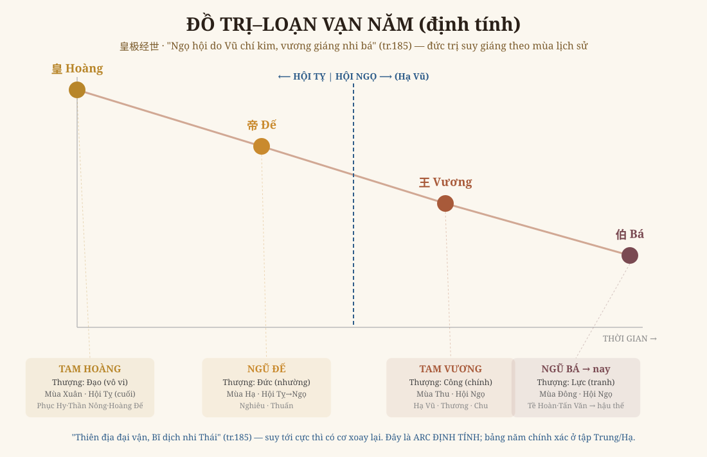

# Chương 3 — Lịch Sử Gắn Vận-Thế: Mô Hình Trị–Loạn Vạn Năm
### 午会由禹至今 · Đọc dòng sử bằng lưới số Hoàng Cực

> *Phục dựng từ tập Thượng (tr.149, 162, 167, 185). Đọc → hiểu → vẽ lại — kèm GIỚI HẠN trung thực.*

---

## 1. Tham vọng của chương này, và một sự thật phải nói trước

Đây là phần làm nên danh tiếng "tiên tri vạn năm" của Hoàng Cực: Thiệu Ung **đặt lịch sử thật vào lưới số** — mỗi triều đại rơi vào một Vận, một Thế, mang một quẻ, từ đó đọc khí trị–loạn của thời đại.

**Cập nhật quan trọng (2026):** Anh đã tìm được **bộ trọn Thượng-Hạ (950 trang)**. Phần tự tự dẫn 何氏《皇极经世解知要》cho **MỐC NEO chính xác**: năm Giáp Tý 304 CN (Lưu Uyên xưng Hán) = **Nguyên Giáp-1 · Hội Ngọ-7 · Vận 188 · Thế 2245**. Nhờ mốc này, engine `hoang_cuc` đã **neo lại đúng** (xem mục 5) — chương này giờ là **ĐỊNH LƯỢNG có cơ sở**, không còn chỉ định tính.

## 2. Cái sách Thượng NÓI RÕ: hội Tỵ → hội Ngọ tại Hạ Vũ

Lời Hoàng thị (tr.185) là mốc chắc chắn nhất:

> *"Dĩ [hội] nhi tiền, hoàng giáng nhi đế… (lục hội chi tiền = cuối thời Tam Hoàng, ngôi Nghiêu Thuấn). **Ngọ hội nhi hậu, vương giáng nhi bá**, mạc bất thượng hình (**Ngọ hội do Vũ chí kim**, kỳ gian chiến loạn…)."*

Dịch: *Trước [bước sang Ngọ], Hoàng giáng xuống Đế — đó là cuối Tam Hoàng, thời Nghiêu Thuấn. Sau khi vào hội Ngọ, Vương giáng xuống Bá, đều chuộng hình phạt — **hội Ngọ tính từ [Hạ] Vũ đến nay**, trong khoảng đó toàn chiến loạn.*

Và mốc neo thứ hai (tr.162, 167): *Nghiêu Thuấn ứng quẻ vùng Càn/Đại Hữu (đầu chu kỳ) · Bình Vương Đông thiên ứng "vận nhập Cấu" (một âm sinh — thời vương đạo bắt đầu tiêu).*

→ **Mô hình rõ ràng:**
- **Tam Hoàng · Ngũ Đế** (Phục Hy → Nghiêu Thuấn): **cuối hội Tỵ**, thượng **Đạo/Đức** — xuân–hạ của lịch sử.
- **Hạ Vũ trở đi = vào hội Ngọ**: **Tam Vương** (thượng Công) → **Ngũ Bá → hậu thế** (thượng Lực, "vương giáng nhi bá"): thu–đông, chiến loạn.

## 3. Vẽ lại — Đồ Trị–Loạn Vạn Năm (định tính)

Đức trị suy giáng theo bốn mùa lịch sử: **Hoàng (Đạo) → Đế (Đức) → Vương (Công) → Bá (Lực)** — đúng chuỗi suy cấp đã gặp ở Nội Thiên (vòng 3). Vạch xanh = ranh hội Tỵ/Ngọ tại Hạ Vũ. Đây là cùng một "đồng dạng" của chương 1–2, nay áp vào TRỤC THỜI GIAN LỊCH SỬ.

## 4. Điểm cốt — đây KHÔNG phải bói, mà là đọc cấu trúc

Câu chốt của Hoàng thị (tr.185): **"Thiên địa đại vận, Bĩ dịch nhi Thái, kỳ cơ tại thử."** — *Vận lớn trời đất, từ Bĩ chuyển sang Thái, cơ ở chỗ này.*

Nghĩa: lịch sử suy tới cực (Bá/Lực/đông) thì **có cơ xoay lại** (Thái/xuân). Hoàng Cực không phán "năm X có loạn" — nó cho **một khung đọc**: ta đang ở mùa nào của chu kỳ lớn, và mùa nào thì khí thế nào. Đúng paradigm "đọc đồng dạng, không predict" (Iron Rule #4/#6): xem *cấu trúc thời*, không xem *số mệnh*.

## 5. ✅ Bug đã sửa — câu chuyện của một phát hiện

Đây là minh chứng sống cho lời Anh dạy *"vẽ lại được thì mới chắc chắn em hiểu sâu sắc"*:

**(a) Làm kỹ → lộ bug.** Khi dựng chương này, em thấy engine `hoang_cuc` đặt Nghiêu (2357 TCN) sai chỗ, và mốc "1980 = thế 2227" (em nhập round 8) **mâu thuẫn toán học** với lời sách "hội Ngọ từ Hạ Vũ". Nếu không vẽ timeline, bug này ẩn mãi.

**(b) Tìm được mốc neo thật.** Anh đưa bộ trọn Thượng-Hạ. Tự tự dẫn 何氏《皇极经世解知要》ghi rõ: **304 CN (Giáp Tý) = Vận 188, Thế 2245, Hội Ngọ 7** (1 thế = 30 năm; 10 năm 甲子→癸酉 = đầu thế 2245). Tự kiểm: ⌈2245/12⌉=188 ✓ ⌈188/30⌉=7 Ngọ ✓.

**(c) Neo lại + kiểm tam-trùng.** Engine neo lại theo mốc này (`NGUYEN_START = 67017 TCN`). Kiểm 4 mốc độc lập đều khớp sách:
- **304 CN** → thế 2245, vận 188, hội Ngọ, **Giáp Tý** ✓ (chính mốc)
- **Nghiêu 2357 TCN** → hội Tỵ (cuối), can chi **Giáp Thìn** ✓ (khớp cả "trước Ngọ hội" lẫn tên "Nghiêu Giáp Thìn")
- **Hạ Vũ ~2071 TCN** → **vận 181 = đầu hội Ngọ** ✓ (khớp "午会由禹至今")
- **1980** → **Canh Thân** ✓

Engine cũ lệch **74 thế (~2.220 năm)** — nay đã đúng. 8/8 test xanh.

**(d) Còn lại:** bảng năm-quẻ chi tiết (vd 304 = quẻ năm **萃** Tụy) là hệ năm-quẻ mịn hơn hội-quẻ — sẽ trích từ bảng 经世 đầy đủ sau khi OCR xong bộ trọn 950 trang (đang chạy nền).

---

*Chương 3 từ "định tính + bug" thành "định lượng + đã sửa" — nhờ đúng cái kỷ luật Anh đặt: vẽ lại để lộ chỗ chưa hiểu, rồi tìm sách mà chữa. Bộ trọn Thượng-Hạ đang OCR sẽ mở nốt bảng năm-quẻ + hệ Luật-Lữ thanh âm cho các chương sau.*
