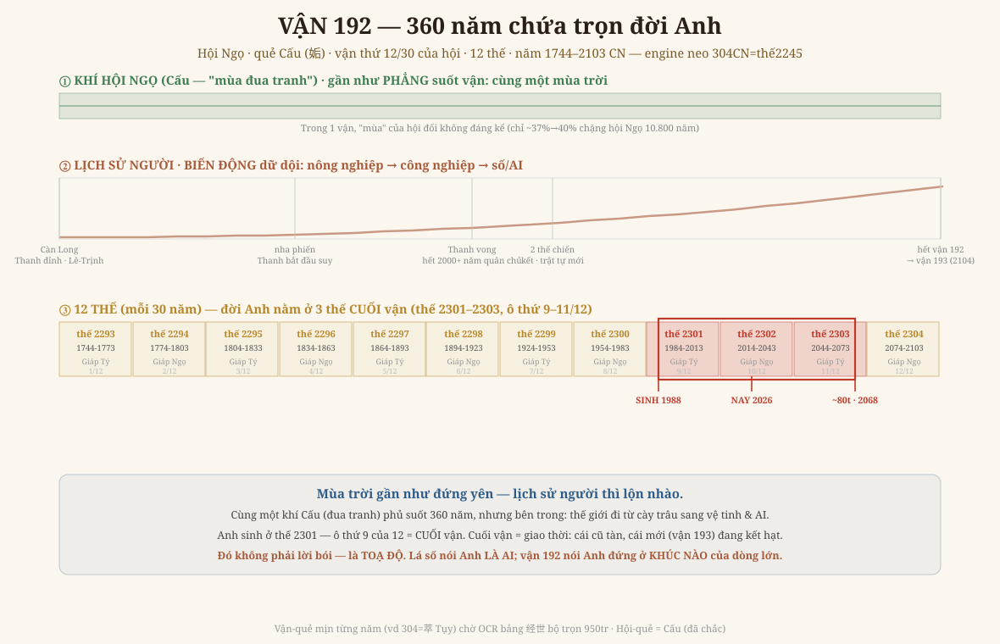
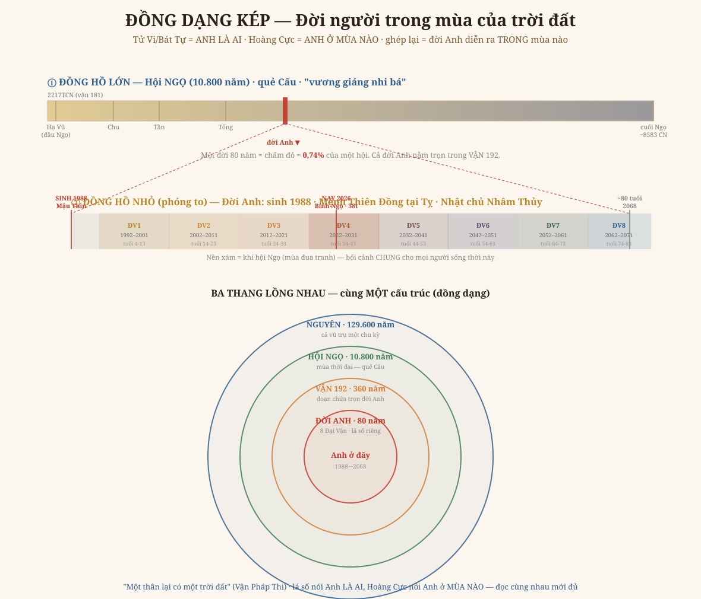

# Chương 4 — Vận 192: Đọc Một Đời Người Trong Lưới Số

### 360 năm chứa trọn một kiếp · "đồng dạng kép" giữa mùa trời và đời người

> *Phục dựng từ mô hình Nguyên-Hội-Vận-Thế (Quan Vật Nội Thiên) + engine `hoang_cuc` đã neo đúng (304 CN = thế 2245). Đọc → hiểu → vẽ lại. Kèm GIỚI HẠN trung thực.*

---

## 1. Một câu hỏi rất đời

Chương 3 đặt cả lịch sử vạn năm vào lưới số. Nhưng Anh hỏi một câu sắc hơn, riêng tư hơn:

> *"Xét được thế-vận-hội từng năm thì dùng vào việc gì cụ thể? Có làm rõ hơn mệnh quẻ một người từ khi sinh ra tới hiện tại, quá khứ, tương lai không?"*

Chương này trả lời bằng **một vận cụ thể: vận 192** — cái vận chứa trọn đời Anh (sinh 1988). Không nói chung chung nữa, mà chỉ thẳng: Anh đang đứng ở đâu trong dòng lớn.

## 2. "Vận" là đơn vị gì

Nhắc lại bậc thang (1 thế = 30 năm):

| Đơn vị | Độ dài | Ví như |
|---|---|---|
| **Thế** (世) | 30 năm | một thế hệ người |
| **Vận** (運) | **360 năm** = 12 thế | một "triều dài" — đủ chứa vài vương triều |
| **Hội** (會) | 10.800 năm = 30 vận | một "mùa" của trời đất |
| **Nguyên** (元) | 129.600 năm = 12 hội | một vòng đời vũ trụ |

**Vận là bậc vừa tay người nhất.** Nó đủ DÀI để ôm cả một thời đại (360 năm = từ vua chúa nông nghiệp tới vệ tinh), nhưng đủ NGẮN để **một đời người (80 năm) nằm gọn trong một vận** — không bị cắt làm đôi. Đó là lý do vận là khung tốt nhất để đặt một kiếp người vào.

## 3. Toạ độ vận 192 (engine tính, khớp sách)

- **Vận 192 = năm 1744 → 2103 CN** (đúng 360 năm)
- Gồm **12 thế: thế 2293 → 2304**
- Là **vận thứ 12 trong 30 vận** của hội Ngọ (hội Ngọ = vận 181–210)
- Nằm ở **~37% chặng đường** của hội Ngọ (hội Ngọ kéo 10.800 năm, từ ~2217 TCN tới ~8583 CN)

→ Cả đời Anh (1988–2068) rơi vào **ba thế cuối** của vận này: thế 2301 (1984–2013), 2302 (2014–2043), 2303 (2044–2073).

## 4. Vẽ lại — Đồ Vận 192

Đồ có **ba băng**, và cái hay nằm ở chỗ **hai băng trên ngược nhau**:

**① Khí hội Ngọ — gần như PHẲNG.** Suốt 360 năm vận 192, ta vẫn ở trong cùng một "mùa trời": hội Ngọ, quẻ **Cấu** (姤 — *một hào âm mới sinh giữa năm hào dương*, tức mùa cực thịnh vừa chớm suy, "vương giáng nhi bá" — đức vương tụt xuống sức bá, mùa đua tranh). Trong một vận, mùa của hội đổi không đáng kể (chỉ trượt từ ~37% sang ~40% của hội). **Cùng một bầu khí phủ lên mọi người sống thời này.**

**② Lịch sử người — BIẾN ĐỘNG dữ dội.** Cũng 360 năm đó, loài người lộn nhào: 1744 còn cày trâu (Càn Long nhà Thanh đỉnh cao, Đàng Ngoài Lê–Trịnh) → 1840 chiến tranh nha phiến, đế chế bắt đầu sụp → 1912 nhà Thanh mất (chấm dứt 2000+ năm quân chủ Trung Hoa) → hai thế chiến → và **đoạn dốc nhất rơi đúng vào đời Anh**: cách mạng số, internet, AI.

**③ Mười hai thế.** Đời Anh khoanh đỏ, vắt qua ô thứ **9–11 trong 12** = **cuối vận**.

> **Đây chính là "đồng dạng kép":** mùa trời gần như đứng yên, nhưng bên trong nó, lịch sử người chạy hết tốc lực. Một kiếp người không cảm được cái mùa-trời chậm rãi (10.800 năm), nhưng cảm rất rõ khúc dốc lịch sử mình rơi vào.

Cùng một ý, nhìn theo "hai đồng hồ lồng nhau" và ba thang đồng tâm:

## 5. Anh đứng ở "cuối vận" — điều đó nói gì

Anh sinh ở **thế 2301 = ô thứ 9 của 12**. Theo lối đồng dạng (Iron Rule #4/#6 — *đọc cấu trúc, không bói*):

- Một **vận** có 12 thế như một **ngày** có 12 giờ, một **năm** có 12 tháng. Ô thứ 9–12 = **chiều muộn / cuối thu** của cái vòng 360 năm này.
- **Cuối vận = giao thời.** Cái cũ (trật tự công nghiệp, đế chế, định chế cũ) đang tàn; hạt giống của **vận 193** (khởi 2104) đang kết. Anh sống đúng cái khe nối hai vận.
- Soi vào việc Anh đang làm — dựng một **nhà xuất bản Đông phương học vận hành bằng AI** — thì nó *đồng dạng* với toạ độ thời: lấy cái cổ (tàn ở vận cũ) tái sinh bằng cái mới (đang kết ở vận sau). Không phải "điềm tốt", mà là **đọc đúng khúc mình đứng rồi đặt việc cho thuận**.

Đây là chỗ trả lời thẳng câu Anh hỏi: **vận KHÔNG cho biết "năm nào tốt xấu".** Nó cho **toạ độ** — Anh đang ở khúc nào của dòng lớn — để các vận riêng của Anh (Đại Vận Tử Vi, Đại Vận Bát Tự) đọc *trong bối cảnh đó* mà rõ nghĩa hơn.

## 6. Ranh giới phải nói thẳng (GIỚI HẠN)

- **Hội-quẻ = Cấu**: chắc chắn (12 bích quái tiêu tức, đã vào engine, kiểm chứng tr.123 + tr.167).
- **Vận-quẻ / năm-quẻ mịn** (kiểu "304 CN = quẻ năm **革 Cách**"): là **hệ phối quẻ chi tiết hơn**, nằm trong bảng 经世 của bộ trọn 950 trang — **OCR đã xong (2026-06-15), năm-quẻ có sẵn trong text**. Chương 5 sẽ tô được **từng năm một quẻ** ở băng ③, để "hai đồng hồ" khớp răng cưa tới từng năm. *(Lưu ý chính xác: 304 là quẻ **革 Cách**, không phải Tụy — em từng ghi nhầm, bộ trọn ghi rõ 「甲子年卦直革」.)* **Em không bịa quẻ năm khi chưa có bảng.**
- Vận 192 là **quẻ của THỜI**, dùng chung cho mọi người sinh cùng vận. Nó **không phải** "quẻ mệnh riêng" của Anh. Quẻ mệnh riêng đến từ Mai Hoa / Thiết Bản / Hà Lạc (lá số cá nhân).

## 7. Chốt chương

**Lá số nói Anh LÀ AI. Vận 192 nói Anh đứng ở KHÚC NÀO của dòng lớn. Phải đọc cùng nhau mới đủ.**

Quá khứ trong khung này = *tấm gương soi mình đã đi qua khúc nào*; hiện tại = *biết mình đang ở chiều muộn của vận, mà hành cho hợp*; tương lai = *không phải lời tiên tri, mà là cái nền để chuẩn bị*. Đúng tinh thần Tổ sư: **"Một vật vốn có một thân, một thân lại có một trời đất"** (Vận Pháp Thi) — đời Anh là một trời đất nhỏ, lồng trong trời đất lớn, cùng một cấu trúc.

---

*Chương 4 dùng được ngay vì chỉ cần engine đã neo đúng, không đợi OCR. Chương 5 (bảng năm-quẻ chi tiết từ bộ trọn 经世) sẽ tô màu từng năm cho băng ③ khi OCR 950 trang hoàn tất.*
