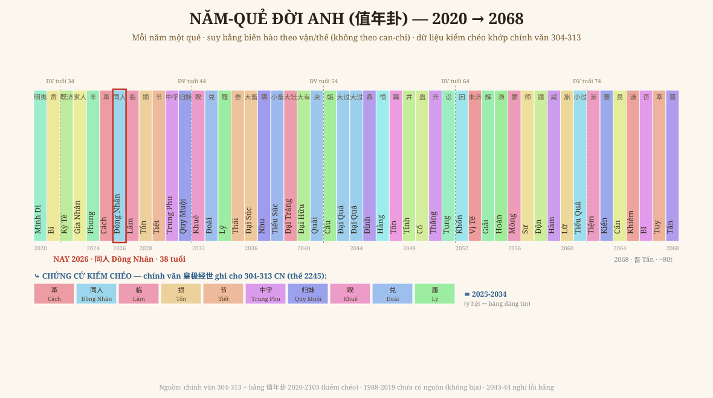

# Chương 5 — Năm-Quẻ (值年卦): Đọc Từng Năm, và Một Cuộc Kiểm Chéo Xuyên 1.700 Năm

### Mỗi năm một quẻ · từ chính văn 304 tới đời Anh · kèm GIỚI HẠN trung thực

> *Dữ liệu: engine `hoang_cuc.nam_que` — chính văn 皇极经世 (thế 2245, 304-313 CN) + bảng 值年卦 2020-2103 (kiểm chéo). Đọc → hiểu → vẽ lại.*

---

## 1. Lời hứa ở Chương 4

Chương 4 nói "hai đồng hồ" — mùa trời (vận) và đời người — và hẹn rằng khi có **năm-quẻ**, ta sẽ tô được **từng năm một quẻ**, để hai đồng hồ khớp răng cưa tới từng năm. Chương này làm đúng việc đó — trong khoảng nguồn cho phép, và nói thẳng chỗ chưa có.

## 2. Phép năm-quẻ — và một sự thật phản trực giác

Năm-quẻ (值年卦) dùng **60 quẻ** — tức 64 quẻ **bỏ 4 quẻ thuần** 乾·坤·坎·离 (chính văn tr.335: *"皇极所用的卦数…去乾坤坎离四卦不用，六十四去四为六十卦"*).

Điều dễ tưởng nhầm: 60 quẻ ứng 60 năm Giáp Tý, vậy cứ năm Giáp Tý là một quẻ cố định? **SAI.** Bằng chứng cứng:

| Năm Giáp Tý | Năm-quẻ |
|---|---|
| 304 CN | **革 Cách** |
| 2044 CN | **大過 Đại Quá** |

Cùng can-chi Giáp Tý mà hai quẻ khác nhau → **năm-quẻ LỒNG theo vận/thế**, suy bằng **biến hào** (邵雍变卦法), không theo vòng can-chi. Chính vì lồng nhiều tầng nên sách thừa nhận đây là phép **bí truyền**:

> *"除张行成、祝泌等数家外，能明其理者甚鲜，故后人卒莫穷其作用之所以然。"*
> — *Ngoài vài nhà như Trương Hành Thành, Chúc Bí, người hiểu được lý của nó rất hiếm; nên người sau rốt cuộc không thấu cái cơ chế tại sao nó vận hành.*

## 3. Ví dụ chính văn — 304 đến 313

Sách nêu trọn 10 năm đầu của thế 2245 (304-313 CN):

`甲子`**革** · `乙丑`**同人** · `丙寅`**临** · `丁卯`**损** · `戊辰`**节** · `己巳`**中孚** · `庚午`**归妹** · `辛未`**睽** · `壬申`**兑** · `癸酉`**履**

Và đọc theo lối **đồng dạng** (không bói): năm 304 = **革 (Cách)**, đúng năm Lưu Uyên xưng vương lập Hán, *"thiên hạ đại loạn, mở mối Nam-Bắc triều"*. Quẻ Cách = **thay cũ đổi mới, cách mạng triều đại** — **quẻ phản chiếu đúng cấu trúc của năm đó**. Đây là tinh thần Iron Rule #4/#6: quẻ là **tấm gương soi cấu trúc thời**, không phải lời phán cát-hung.

## 4. Research (Iron Rule #1) + một cuộc kiểm chéo đắt giá

Bản 今说 chỉ cho **một ví dụ** (304-313), không có bảng năm-quẻ liên tục. Theo kỷ luật "tra giải pháp sẵn trước", em tìm được nguyên lý biến hào + một **bảng 值年卦 hiện đại** phủ 2020-2120.

Nhưng bảng hiện đại có đáng tin? Em **kiểm chéo** với chính văn — và đây là chỗ đắt nhất:

> **Bảng hiện đại ghi 2025-2034 = 革·同人·临·损·节·中孚·归妹·睽·兑·履 — Y HỆT chuỗi sách cổ ghi cho 304-313.**

Một bảng đời nay **tái lập đúng từng quẻ** một ví dụ trong sách thế kỷ 11 — xác suất trùng ngẫu nhiên 10 quẻ liên tiếp gần như bằng 0. Thêm: bảng dùng **đúng 60 quẻ** (không quẻ thuần nào), khớp nguyên lý tr.335. → **Bảng đáng tin trong khoảng 2020-2103.** (Em vẫn đánh dấu **2043-2044 nghi lỗi** vì nguồn ghi trùng 大過.)

## 5. Vẽ lại — Năm-Quẻ Đời Anh

Mỗi cột một năm, một quẻ, một màu. Khoanh đỏ = **NAY 2026**. Hàng dưới = chứng cứ kiểm chéo (304-313 ≡ 2025-2034). Đọc đồng dạng vài mốc của Anh:

- **2026 = 同人 (Đồng Nhân)** — *"cùng với người"*, hợp quần, đại đồng. Khoảnh khắc này của thời phản chiếu cấu trúc **chung-sức, kết-người**. Soi vào việc Anh đang dựng (một nhà xuất bản, một cộng đồng đọc) — năm nay là năm của **đồng-người**, không phải đơn-độc.
- **2068 = 晋 (Tấn)** — *tiến lên, hiển đạt* (lúc Anh ~80).
- **2103 = 姤 (Cấu)** — đúng **quẻ của hội Ngọ**. Hết vận 192, năm-quẻ **trở về quẻ-hội** — như một vòng khép, tiểu-chu-kỳ chạm lại đại-chu-kỳ. Một "đồng dạng" gọn gàng của hệ.

## 6. Giới hạn phải nói thẳng (GIỚI HẠN)

- **1988-2019** (Anh sinh → 31 tuổi): **chưa có trong nguồn xác**. Engine trả `None` — **em KHÔNG suy ngoại để bịa** một dải quẻ cho quá khứ của Anh.
- **2043-2044**: nguồn ghi trùng 大過 — đánh dấu nghi, chờ bảng 经世 gốc.
- **Thuật toán đầy đủ** (suy năm-quẻ bất kỳ bằng biến hào) **chưa tái dựng** — đó là phép Trương Hành Thành / Chúc Bí, sách gọi là hiếm người thấu. Khi nào tái dựng được + kiểm khớp **cả hai lớp** (304-313 và 2020-2103) thì mới mở rộng. Hiện tại chỉ dùng **dữ liệu đã kiểm**, không dùng công thức chưa chắc.

## 7. Chốt — hai đồng hồ đã khớp tới từng năm (trong vùng có nguồn)

Giờ thì lời hẹn Chương 4 thành thật: trong **2020-2068**, ta đọc được **đời Anh từng năm một quẻ**, đặt **trong** mùa lớn hội Ngọ / vận 192. Nhưng xin nhắc lại tinh thần Tổ sư: đây **không phải lịch tiên tri** "năm nào hên xui". Năm-quẻ là **tấm gương soi cấu trúc của năm** — để Anh **đọc khoảnh khắc, hành cho hợp**, đúng paradigm *quan-vật-trace-tính*. Lá số nói Anh LÀ AI; vận nói Anh Ở MÙA NÀO; năm-quẻ nói **năm nay mang cấu trúc gì** — ba lớp, đọc cùng nhau.

---

*Chương 5 khép phần "đọc đời mình trong lưới số". Việc còn lại của bộ sách: hệ **Luật-Lữ thanh âm** (thanh luật ứng với số) và đọc sâu **Ngoại Thiên** (82+ tiết) — sẽ thành các chương sau.*
