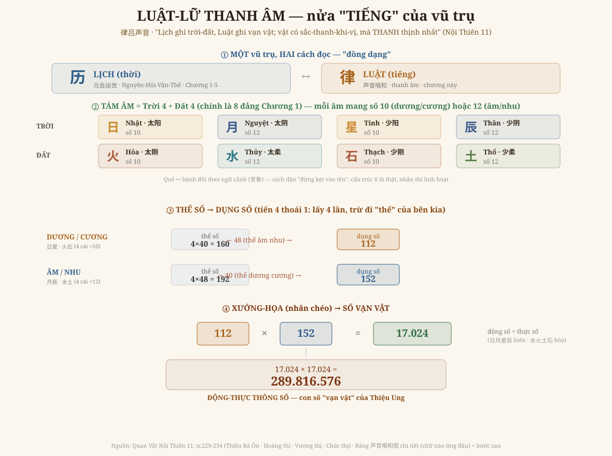

# Chương 6 — Luật-Lữ Thanh Âm: Nửa "Tiếng" Của Vũ Trụ

### 律吕声音 · Sau khi đọc THỜI bằng lịch, Hoàng Cực đọc VẠN VẬT bằng tiếng

> *Phục dựng từ Quan Vật Nội Thiên 11 (bộ trọn, tr.229-234) — lời Thiệu Bá Ôn, Hoàng thị, Vương thị, Chúc thị. Đọc → hiểu → vẽ lại. Kèm GIỚI HẠN trung thực.*

---

## 1. Nửa sách ta chưa chạm

Năm chương đầu đọc **THỜI**: Nguyên-Hội-Vận-Thế, lưới số của thời gian. Nhưng đó mới là **một nửa** Hoàng Cực. Bộ sách có hai cánh, và lời Hoàng thị (tr.229) nói thẳng:

> *"上篇元会运世，历也；此篇阴阳刚柔，律也。历居阳治阴，故专言天；律居阴治阳，故兼言地。"*
>
> *"Thiên trên (Nguyên-Hội-Vận-Thế) là **LỊCH**; thiên này (âm-dương cương-nhu) là **LUẬT**. Lịch ở dương trị âm, nên chuyên nói Trời; Luật ở âm trị dương, nên gồm cả Đất."*

**Lịch ghi THỜI, Luật ghi VẬT.** Và vì sao "vật" lại đọc bằng "tiếng"? Vì (tr.230): *"vật có sắc-thanh-khí-vị, mà **thanh (tiếng) thịnh nhất**"* — trong bốn thứ nhận biết được của một vật, tiếng là cái biến hóa giàu nhất, nên Thiệu Ung lấy **tiếng** làm chìa khóa đọc vạn vật.

## 2. Vì sao "tiếng" đọc được hưng-suy

Đây không phải ý riêng Thiệu Ung. Tổ tông Nho gia đã nói (tr.230):

> *Khổng Tử: "Di phong dịch tục, mạc thiện ư nhạc" (đổi phong tục, không gì hơn nhạc).*
> *Tử Hạ — Thi Tự: "Nhạc đời trị thì an mà vui, chính sự hòa; nhạc đời loạn thì oán mà giận, chính sự trái; nhạc nước mất thì rầu mà lo, dân khốn."*

Cổ nhân **nghe nhạc mà biết nước thịnh hay suy**. Thiệu Ung hệ thống hóa điều đó thành **số** — "thanh âm chi đạo dữ chính thông" (đạo của tiếng thông với việc trị nước).

## 3. Vẽ lại — kiến trúc số của thanh âm

Đọc đồ từ trên xuống — bốn tầng:

**① Một vũ trụ, hai cách đọc.** Lịch (历) và Luật (律) là hai cánh **đồng dạng** của cùng một cấu trúc.

**② Tám âm = Trời 4 + Đất 4.** (tr.230, lời Thiệu Bá Ôn):
- **Trời**: 日 Nhật (太阳, 10) · 月 Nguyệt (太阴, 12) · 星 Tinh (少阳, 10) · 辰 Thần (少阴, 12)
- **Đất**: 火 Hỏa (太刚, 10) · 水 Thủy (太柔, 12) · 石 Thạch (少刚, 10) · 土 Thổ (少柔, 12)

Quy luật số: **dương & cương = 10, âm & nhu = 12** (vì *"số dương 1 nhân ra 10 — như 10 thiên can; số âm 2 nhân ra 12 — như 12 địa chi"*, tr.231). Tám âm này **chính là 8 đẳng của Chương 1** — cùng tám quẻ Càn-Đoài-Ly-Chấn / Tốn-Khảm-Cấn-Khôn. Nhưng có một điểm sâu sách dặn kỹ (tr.233):

> *"千万不可被其中的许多名词所困" — chớ để bị các tên gọi làm rối. Càn-Đoài-Ly-Chấn có thể là 日月星辰, cũng có thể là hàn-thử-trú-dạ, là tính-tình-hình-thể…"*

Tức **quẻ và hành đổi nhãn cho nhau theo ngữ cảnh (变象)**. Cấu trúc TÁM là thật và bất biến; cái tên dán lên nó thì linh hoạt. Đây đúng tinh thần đọc-đồng-dạng: ta đọc **cấu trúc**, không thờ **cái tên**.

**③ Thể số → Dụng số (tiến 4 thoái 1).** Mỗi nhóm 4 âm:
- Dương/cương: 4 cái ×10 = 40 (bản số), nhân 4 = **160** (thể số). Trừ 48 (thể của âm nhu) = **112** (dụng số).
- Âm/nhu: 4 cái ×12 = 48, nhân 4 = **192** (thể số). Trừ 40 (thể của dương cương) = **152** (dụng số).

Vì sao phải "thoái" (trừ đi)? Vì *"dương trong có âm, âm trong có dương"* (tr.232) — không khối nào thuần khiết, nên mỗi bên phải trừ phần của bên kia mới ra cái **dùng được**. "Thể thì bất động, động rồi mới sinh biến hóa; nên nói **số** là nói từ chỗ **dụng**" (lời Vương thị, tr.232).

**④ Xướng-Họa → số vạn vật.** Lấy hai dụng số **xướng họa** (nhân chéo) nhau (tr.234):
- 112 × 152 = **17.024** = *biến số của 日月星辰* = **động số** (số loài động)
- 152 × 112 = **17.024** = *hóa số của 水火土石* = **thực số** (số loài thực vật)
- Lại xướng-họa hai cái: 17.024 × 17.024 = **289.816.576** = **động-thực thông số** — con số "vạn vật" của Thiệu Ung.

## 4. Vì sao chương này quan trọng

Năm chương đầu cho thấy Hoàng Cực đọc **thời gian** bằng số. Chương này cho thấy nó đọc **sự vật** cũng bằng số — và bằng **cùng một bộ tám**, cùng một lối tiến-thoái thể-dụng. **Thời và Tiếng là hai mặt của một đồng tiền.** Đó là lý do bộ sách gọi là *Hoàng Cực* — một cái khung tối cao bao trùm cả thời lẫn vật.

Và một lần nữa, paradigm không đổi (Iron Rule #4/#6): những con số khổng lồ này — 17.024, 289 triệu — **không phải để bói** "vũ trụ có bao nhiêu con vật". Chúng là **cách Thiệu Ung diễn cái VÔ HẠN bằng một cấu trúc ĐẾM ĐƯỢC** — để tâm người nắm được cái lớn. Số là **tấm gương soi cấu trúc**, không phải bản kiểm kê.

## 5. Ranh giới phải nói thẳng (GIỚI HẠN)

- Chương này dựng **kiến trúc SỐ** của thanh âm (thể-dụng-xướng-họa) — phần này chính văn nói rõ, số kiểm lại khớp từng phép (112×152=17.024; 17.024²=289.816.576).
- **Bảng 声音唱和图 chi tiết** — tức *chữ/âm tiếng Hán nào* ứng vào ô nào (天声 = vận mẫu 平-上-去-入; 地音 = thanh mẫu 开-发-收-闭) — là một hệ ngữ âm học cổ rất tinh vi, nằm ở "Chính âm luật số" (Ngoại Thiên, tr.677+) và phần lớn ở dạng **bảng/ảnh**. Đó là **bước sau** — em chưa dựng, và **không bịa** chữ vào ô.
- Vài chỗ quẻ và hành trong chính văn **đổi theo đoạn (变象)**; em trình bày số theo bản Thiệu Bá Ôn (tr.230) — bản dùng ngay tại chỗ lập số — và nói rõ tính 变象 thay vì ép một bảng cứng.

---

*Chương 6 mở cánh thứ hai (Luật) của Hoàng Cực. Còn lại: dựng đầy đủ bảng 声音唱和图 (ngữ âm) và đọc sâu các tiết Ngoại Thiên — thành các chương sau.*
