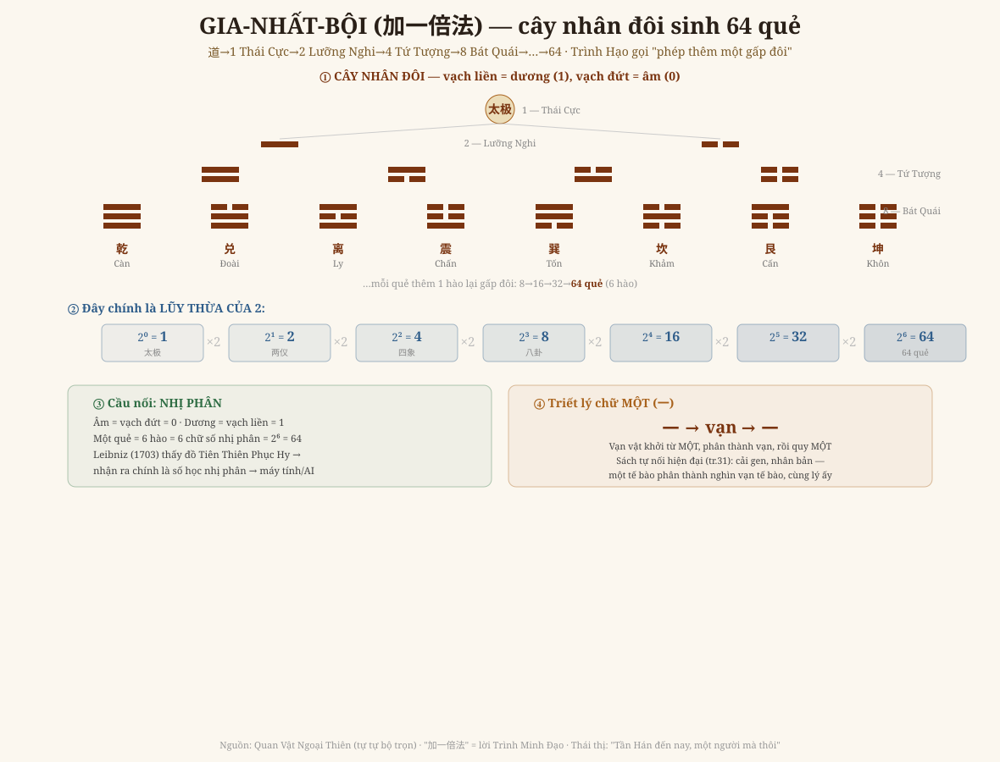

# Chương 7 — Gia-Nhất-Bội: Cái Máy Sinh Ra Vạn Vật

### 加一倍法 · Phép nhân đôi của Thiệu Ung — và vì sao 600 năm sau nó thành số nhị phân

> *Phục dựng từ Quan Vật Ngoại Thiên + tự tự bộ trọn (tr.29-31). Lời Thiệu Bá Ôn, Trình Minh Đạo, Tây Sơn Thái thị. Đọc → hiểu → vẽ lại. Kèm GIỚI HẠN trung thực.*

---

## 1. Cái gì SINH ra 64 quẻ?

Sáu chương trước dùng lưới số — 64 ô, 8 đẳng, các con số khổng lồ — để đọc thời và vật. Nhưng **cái gì sinh ra cái lưới ấy?** Ngoại Thiên trả lời bằng một câu gọn mà chứa cả vũ trụ (tr.30):

> *"道生一，一为太极；一生二，二为两仪；二生四，四为四象；四生八，八为八卦；八生六十四，有了六十四卦。而后，天地万物之道，因而完备。"*
>
> *"Đạo sinh **một** — một là Thái Cực; một sinh **hai** — hai là Lưỡng Nghi; hai sinh **bốn** — bốn là Tứ Tượng; bốn sinh **tám** — tám là Bát Quái; tám sinh **sáu mươi tư**. Sau đó, đạo của trời-đất-vạn-vật mới hoàn bị."*

Một phép duy nhất, lặp đi lặp lại: **cứ thêm một hào thì gấp đôi**. Trình Minh Đạo (Trình Hạo) đặt cho nó một cái tên đắt giá — **加一倍法**, "phép thêm một gấp đôi" (tr.30, tr.305). Tây Sơn Thái thị khen Thiệu Ung nhờ phép này mà thành *"Tần Hán đến nay, một người mà thôi"*.

## 2. Vẽ lại — cây nhân đôi

**① Cây nhân đôi.** Từ Thái Cực (1), mỗi bước thêm một hào — vạch liền (dương) hoặc vạch đứt (âm) — số quẻ gấp đôi: 1 → 2 (Lưỡng Nghi) → 4 (Tứ Tượng) → 8 (Bát Quái) → 16 → 32 → **64**.

**② Đó chính là lũy thừa của 2.** 1, 2, 4, 8, 16, 32, 64 — tức **2 nhân đôi sáu lần** (2 mũ 0 đến 2 mũ 6). Một quẻ có 6 hào, mỗi hào hai khả năng → 2 mũ 6 = 64. Không hơn, không kém.

**③ Và đó là SỐ NHỊ PHÂN.** Coi âm = 0, dương = 1, thì mỗi quẻ là một chuỗi 6 chữ số nhị phân. Đây không phải em gán ghép: năm **1703**, **Leibniz** — cha đẻ số nhị phân của toán học phương Tây — khi xem **đồ Tiên Thiên Phục Hy** (do giáo sĩ Bouvet gửi từ Trung Hoa) đã sững sờ nhận ra **dãy quẻ tiên thiên chính là dãy số nhị phân 0–63**, và viết hẳn điều đó trong công bố nhị phân của ông. Cái mà Thiệu Ung vẽ năm ~1060 và Phục Hy truyền từ ngàn xưa, phương Tây gặp lại sau **sáu thế kỷ** — và nó thành nền của **máy tính, của AI**.

## 3. Triết lý chữ MỘT (一)

Vì sao chỉ một phép nhân đôi mà đủ sinh vạn vật? Vì gốc là **MỘT** (tr.31):

> *"天地万物莫不从一开始，故以一为本" — trời-đất-vạn-vật không gì chẳng khởi từ MỘT, nên lấy MỘT làm gốc.*

Và đường đi là: **một → phân thành vạn → rồi quy về một**. Điều đáng kinh ngạc: chính sách (bản 今说) **tự nối sang khoa học hiện đại** (tr.31):

> *"Khoa học gia cận đại cải tạo gen, nhân bản sự sống, cũng từ nguyên lý 'một' này: trời-đất-vạn-vật, từ **một tế bào** phân thành nghìn nghìn vạn vạn tế bào — mà sở dĩ sinh sinh bất tức, lại do ở **một**."*

Một tế bào phân đôi, phân đôi, phân đôi… thành cả cơ thể. Đó **đúng là gia-nhất-bội của sự sống**. Thiệu Ung gọi cái Một ấy là **"thiên địa chi tâm"** (tâm của trời đất) — như quẻ Phục (一陽初生) mà Kinh Dịch nói *"phục kỳ kiến thiên địa chi tâm"*.

## 4. Vì sao chương này khép vòng cả bộ sách

Gia-nhất-bội là **cái máy** đứng sau mọi chương trước:
- **Lưới thời** (Chương 1-5): Nguyên-Hội-Vận-Thế nhân tầng ×12, ×30 — cũng là nhân-bội, chỉ khác cơ số.
- **Số tiếng** (Chương 6): tám âm, thể-dụng, xướng-họa — cũng từ tám (2 mũ 3) mà nhân lên.
- **Tám đẳng** (Chương 1): chính là 2 mũ 3 = tầng thứ ba của cây này.

Một phép nhân đôi, hiện ra ở mọi tầng, mọi mặt — **đó là "đồng dạng" ở dạng thuần khiết nhất**: không phải nhiều quy luật, mà **một quy luật lặp ở mọi cỡ**.

Và một vòng khép thật đẹp cho riêng Anh: Chương 4 nói Anh sống ở **vận 192 — thời của số, của AI**. Mà nền của số và AI là **nhị phân** — chính là **加一倍法** Thiệu Ung vẽ ngàn năm trước. **Anh đang dùng AI (con của nhị phân) để đọc lại cái phép nhị phân của Tổ sư.** Cái cũ tàn ở vận trước, tái sinh bằng cái mới ở vận sau — đúng như Chương 4 đã đọc.

## 5. Ranh giới phải nói thẳng (GIỚI HẠN)

- **Phép nhân đôi 1→2→4→8→…→64** và tên **加一倍法**: chính văn nói rõ, không suy diễn.
- **Tương ứng nhị phân Leibniz**: là **sự thật lịch sử** (Leibniz 1703, qua Bouvet), em đưa vào như **cầu nối** — *không* phải bản 今说 viết (bản này nối sang gen/tế bào, tr.31). Em phân biệt rạch ròi: cái nào của sách, cái nào là cầu nối hiện đại.
- **Thứ tự bit chính xác** (đồ Tiên Thiên Phục Hy cho 0–63, khác thứ tự Văn Vương) là một điểm tinh vi; em nói đúng dãy *tiên thiên* mới khớp 0–63, **không** vơ đũa mọi cách sắp quẻ.
- **Đồ Tiên Thiên tròn-vuông (圆图/方图)** và **đồ 256 vị** đầy đủ là bước vẽ sau — chương này dựng *nguyên lý sinh* (cây nhân đôi), chưa dựng trọn các đại đồ.

---

*Chương 7 chỉ ra cái MÁY sinh — gia-nhất-bội — đứng sau toàn bộ lưới số. Còn lại: dựng trọn đồ Tiên Thiên tròn-vuông, bảng 声音唱和图 ngữ âm, và các tiết Ngoại Thiên khác.*
