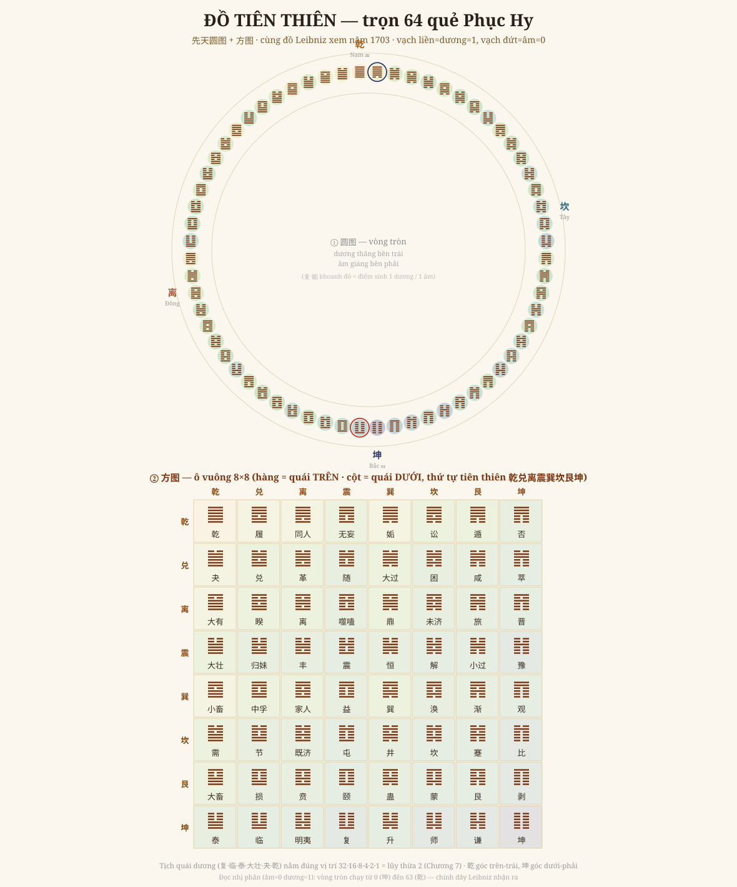

# Chương 8 — Đồ Tiên Thiên: Bản Đồ Tròn-Vuông Của 64 Quẻ

### 先天圆图 + 方图 · Cây nhân đôi của Chương 7, nay xếp thành bản đồ vũ trụ

> *Phục dựng từ Quan Vật + tự tự bộ trọn (mục lục Phụ lục ch.3-4 "tiên thiên viên/phương đồ quái số", tr.425, 436; mô tả chiều xoay tr.30). Thứ tự tiên thiên kiểm bằng nhị phân. Đọc → hiểu → vẽ lại.*

---

## 1. Từ "cây" sang "bản đồ"

Chương 7 cho thấy **cách SINH** 64 quẻ (nhân đôi). Chương này cho thấy **cách XẾP** chúng — thành hai đồ hình trứ danh nhất của Thiệu Ung:

- **圆图 — đồ TRÒN**: 64 quẻ vòng quanh một vòng tròn (tròn như trời).
- **方图 — đồ VUÔNG**: 64 quẻ trong lưới 8×8 (vuông như đất).

**Trời tròn đất vuông (天圆地方)** — hai đồ là hai mặt của cùng 64 quẻ.

## 2. Vẽ lại — đồ Tiên Thiên

**Cách bài trí** (chính văn tr.30, *"tiên thiên đồ tả tuyền thuận hành"*):
- **乾** (toàn dương) ở **Nam = đỉnh**; **坤** (toàn âm) ở **Bắc = đáy**.
- Bên **trái dương thăng**: từ **复** (đáy, một dương mới sinh) đi lên 临 → 泰 → … → **乾** (đỉnh, sáu dương).
- Bên **phải âm giáng**: từ **姤** (đỉnh, một âm mới sinh) đi xuống 遁 → 否 → … → **坤** (đáy).
- (Theo lối cổ: *trên Nam, dưới Bắc, trái Đông, phải Tây* — nên 离 ở trái-Đông, 坎 ở phải-Tây.)

## 3. Đọc đồ TRÒN — đó là một cái đồng hồ

Vòng tròn này **không phải để trang trí** — nó là **đồng hồ khí âm-dương**, đọc y như một năm hay một ngày:

| Vị trí | Quẻ | Như mùa |
|---|---|---|
| Đáy | **复** (1 dương) | Đông chí — dương vừa sinh |
| Lên trái | 临·泰·大壮·夬 | Xuân — dương lớn dần |
| Đỉnh | **乾** (6 dương) | Hạ chí — dương cực |
| Xuống phải | **姤**(1 âm)·遁·否·观·剥 | Thu-đông — âm lớn dần |
| Đáy | **坤** (6 âm) | Đại hàn — âm cực, rồi 复 lại sinh |

Đây **đúng là cấu trúc của "đồng hồ thời"** ở Chương 4 — quẻ chạy quanh vòng như mùa chạy quanh năm, như vận chạy quanh hội. Và chính sách nối thẳng hai thứ (tr.galley): *"chữ 复 dưới 'tinh giáp nhất' chính là **值卦** (quẻ-trực), cũng gọi là **đại vận**"* — tức **vị trí trên vòng Tiên Thiên này chính là cái sinh ra quẻ của vận/năm** ở các chương trước. Một lần nữa: **đồng dạng** — vòng nhỏ (64 quẻ) cùng khuôn vòng lớn (元会运世).

## 4. Đọc đồ VUÔNG — bảng tra đầy đủ

Đồ vuông 8×8 cho **trọn 64 tên quẻ**: hàng = quái **trên**, cột = quái **dưới** (đều theo thứ tự tiên thiên 乾兑离震巽坎艮坤). **乾** góc trên-trái, **坤** góc dưới-phải. **Đường chéo** chính là tám **quẻ kép** (乾·兑·离·震·巽·坎·艮·坤 — trên dưới cùng một quái).

Và một vẻ đẹp nối về Chương 7: **sáu tịch quái dương** (复·临·泰·大壮·夬·乾) nằm đúng các vị trí số **32·16·8·4·2·1 = lũy thừa của 2** trong thứ tự tiên thiên. Cái xương sống âm-dương của vòng tròn chính là **xương sống nhân-đôi** của cây gia-nhất-bội.

## 5. Và đây là đồ Leibniz đã xem

Như Chương 7 đã nói: coi **âm = 0, dương = 1**, đọc vòng tròn từ **坤 (000000 = 0)** đến **乾 (111111 = 63)** — ta được **đúng dãy số nhị phân 0–63**. Đây **chính là đồ** mà giáo sĩ Bouvet gửi cho **Leibniz**, và năm 1703 Leibniz nhận ra nó là số học nhị phân. Tấm "bản đồ vũ trụ" ngàn năm tuổi này, đọc bằng mắt toán học hiện đại, là **bảng đếm nhị phân 6-bit hoàn chỉnh**.

## 6. Vì sao chương này quan trọng

Đồ Tiên Thiên là chỗ **mọi sợi của bộ sách tụ lại**:
- **Cây nhân đôi** (Ch7) → xếp thành **vòng + vuông** (Ch8).
- Vòng tròn = **cùng cấu trúc đồng hồ thời** (Ch4) — quẻ quanh vòng như vận quanh hội.
- Nhị phân (Ch7) hiện rõ trên chính đồ này → nối thời số/AI của Anh.
- Đường chéo + tịch quái nối lại **tám đẳng** (Ch1) và **lũy thừa 2**.

Một đồ hình — chứa cả phép sinh, cả nhịp mùa, cả số nhị phân. Đó là lý do nó là **biểu tượng** của Hoàng Cực.

## 7. Ranh giới phải nói thẳng (GIỚI HẠN)

- **Thứ tự tiên thiên** (Càn 1 … Khôn 64) và **vị trí từng quẻ**: kiểm bằng nhị phân, khớp chuẩn truyền thống + mô tả chính văn (复→乾 thăng trái, 姤→坤 giáng phải).
- **Hướng la bàn** theo **lối cổ** (trên Nam, trái Đông) — khác bản đồ hiện đại (trên Bắc); em ghi rõ để Anh khỏi nhầm.
- **Tương ứng nhị phân 0–63 / Leibniz**: phần đọc-nhị-phân là **cầu nối hiện đại** (như Ch7), không phải lời bản 今说.
- Các **đại đồ chi tiết hơn** (256 vị, 384 hào, 圆中有方…) chưa dựng — chương này dựng **viên đồ + phương đồ gốc**.

---

*Chương 8 dựng biểu tượng trung tâm của Hoàng Cực. Còn lại của bộ sách: bảng 声音唱和图 ngữ âm đầy đủ, đồ Hà Đồ – Lạc Thư số, và các tiết Ngoại Thiên khác.*
