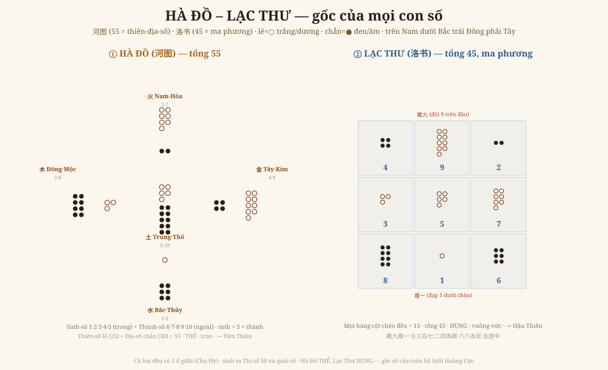

# Chương 9 — Hà Đồ – Lạc Thư: Nơi Con Số Bắt Đầu

### 河图洛书 · Trước khi có quẻ, có SỐ — và Ngoại Thiên mở đầu bằng đúng điều đó

> *Phục dựng từ Quan Vật Ngoại Thiên chương 1 "河图天地全数" (bộ trọn, tr.276; 57 tiết — chương lớn nhất Ngoại Thiên). Số kiểm bằng tay. Đọc → hiểu → vẽ lại.*

---

## 1. Ngoại Thiên bắt đầu bằng SỐ

Suốt tám chương, ta dùng số để đọc thời, vật, quẻ. Nhưng **bản thân con số đến từ đâu?** Câu trả lời nằm ngay ở **tiết mở đầu của toàn bộ Ngoại Thiên**: chương 1 — **河图天地全数** (Hà Đồ thiên-địa toàn số), **57 tiết**, dài nhất. Với Thiệu Ung, **số là chuyện đầu tiên** — và gốc của mọi số là hai đồ hình cổ nhất của Dịch: **Hà Đồ** và **Lạc Thư**.

(Để Anh định vị: Ngoại Thiên có **12 chương** — bắt đầu *河图 số* (ch.1), rồi *tiên thiên tượng số* (ch.2), *tiên thiên viên đồ* (ch.3), *phương đồ* (ch.4), *hậu thiên* (ch.5-6), *运数* (ch.7)… Cả Chương 7-8 của sách này chính là rút từ ch.2-4 đó.)

## 2. Vẽ lại — Hà Đồ và Lạc Thư

Quy ước: **số lẻ = chấm trắng ○ = Thiên/dương**; **số chẵn = chấm đen ● = Địa/âm** (trên Nam, dưới Bắc, trái Đông, phải Tây — lối cổ).

**① Hà Đồ (河图) — tổng 55.** Mười con số xếp theo **ngũ hành + phương** (chính văn tr.276): 

| Phương | Số | Ngũ hành |
|---|---|---|
| Bắc | 1 – 6 | Thủy |
| Nam | 2 – 7 | Hỏa |
| Đông | 3 – 8 | Mộc |
| Tây | 4 – 9 | Kim |
| Trung | 5 – 10 | Thổ |

Mỗi phương một cặp: **sinh-số** (1·2·3·4·5, ở trong) và **thành-số** (6·7·8·9·10, ở ngoài) — và **sinh-số + 5 = thành-số** (1+5=6, 2+5=7…). Cộng tất cả: Thiên-số lẻ (1+3+5+7+9 = 25) + Địa-số chẵn (2+4+6+8+10 = 30) = **55** — chính là *"thiên-địa chi số"* mà Hệ Từ nói.

**② Lạc Thư (洛书) — tổng 45, ma phương.** Chín con số (1–9) xếp 3×3 sao cho **mọi hàng, mọi cột, mọi đường chéo đều cộng = 15**: *戴九履一* (đội 9 trên đầu, đạp 1 dưới chân), *左三右七*, *二四為肩*, *六八為足*, *五居中*. Đây là **ma phương bậc 3** đầu tiên của nhân loại — và nó **tự cân bằng tuyệt đối** quanh số 5 ở giữa.

## 3. Hai đồ — Thể và Dụng

Hà Đồ và Lạc Thư không phải hai thứ rời:
- **Hà Đồ** = 10 số, **tròn đầy**, đối xứng theo cặp → **THỂ** (gốc tĩnh) → sinh ra **Tiên Thiên**.
- **Lạc Thư** = 9 số, **vuông-vức**, xoáy ma phương → **DỤNG** (vận động) → sinh ra **Hậu Thiên**.
- Cả hai **đều có số 5 ở giữa** (Chu Hy chỉ ra) — cùng một tâm.

Và quan trọng cho cả bộ sách: chính văn (tr.galley) nói thiên-địa-số này **sinh ra Thi-số 50 (蓍数) và quái-số (卦数)**. Tức **mọi con số ta gặp** — 8 đẳng, Nguyên-Hội-Vận-Thế, thể-dụng thanh âm, gia-nhất-bội — đều **mọc lên từ cái 55 này**. Đây là **tầng gốc nhất**.

## 4. Vì sao chương này là nền móng

Bộ sách đi từ ngọn xuống gốc:
- Ch1-5: lưới **thời**; Ch6: số **tiếng**; Ch7: **máy sinh** (nhân đôi); Ch8: **bản đồ** 64 quẻ.
- **Ch9 (chương này): nơi SỐ bắt đầu** — Hà Đồ 55, Lạc Thư 45.

Thiệu Ung không xem số là công cụ tính toán, mà là **ngôn ngữ của vũ trụ**: trời đất "nói" bằng số, và đọc được số là đọc được cấu trúc. Đó là vì sao toàn bộ Hoàng Cực là một công trình **lấy SỐ làm xương** — và xương ấy bắt đầu từ những chấm trắng-đen này. Vẫn đúng paradigm: **không bói bằng số, mà đọc cấu trúc bằng số.**

## 5. Ranh giới phải nói thẳng (GIỚI HẠN)

- **Cấu trúc Hà Đồ (55, ngũ hành-phương, sinh/thành) và Lạc Thư (45, ma phương = 15)**: số kiểm bằng tay, khớp chính văn (tr.276) + truyền thống.
- Hà Đồ–Lạc Thư là **di sản chung của Dịch học** (không riêng Thiệu Ung) — nhưng Thiệu Ung **đặt nó làm gốc số** và Ngoại Thiên dành 57 tiết cho nó, nên nó thuộc về bộ sách này một cách chính đáng.
- Các **tranh luận học thuật** (Hà Đồ hay Lạc Thư có trước; cách phối 蓍数 50 chi tiết; "trung số đều 5" của Chu Hy so với các thuyết khác) — chính văn có bàn (tr.galley) nhưng **em không sa vào** ở chương nền móng này; sẽ mở khi dựng các tiết số chi tiết.

---

*Chương 9 chạm tới tầng gốc nhất — số. Bộ sách giờ đủ một vòng: từ SỐ (Ch9) → MÁY SINH (Ch7) → BẢN ĐỒ quẻ (Ch8) → LƯỚI thời (Ch1-5) → SỐ tiếng (Ch6). Còn lại của Ngoại Thiên: bảng 声音唱和图 ngữ âm, hậu thiên lý số, các tiết 运数 — thành các chương sau.*
