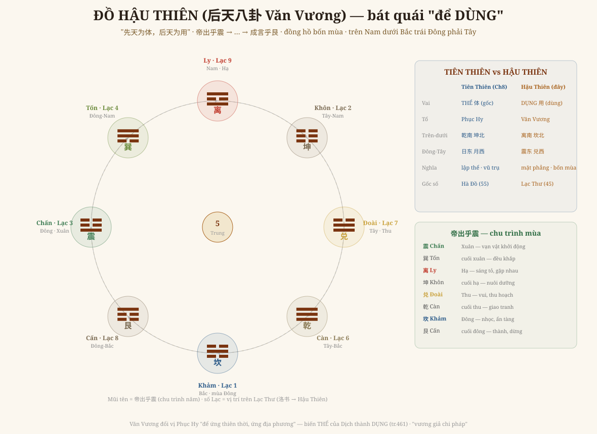

# Chương 10 — Đồ Hậu Thiên: Bát Quái Để Sống Trong Đời

### 后天八卦 Văn Vương · Tiên Thiên cho biết vũ trụ LÀ GÌ — Hậu Thiên cho biết SỐNG trong nó thế nào

> *Phục dựng từ Quan Vật Ngoại Thiên ch.5 "后天象数" (bộ trọn, tr.461) + 说卦传 ch.5. Đọc → hiểu → vẽ lại. Kèm GIỚI HẠN trung thực.*

---

## 1. Cùng tám quẻ, khác chỗ đứng

Chương 8 vẽ **Tiên Thiên** (Phục Hy) — bản đồ vũ trụ ở dạng **gốc**. Nhưng có một đồ thứ hai, dùng **cùng tám quái** mà **xếp khác vị trí**: **Hậu Thiên** (Văn Vương). Lời chính văn nói thẳng cái khác nhau cốt tử (tr.461):

> *"先天图为乾南坤北… 后天图为震东兑西，离南坎北… 先天图为体，后天图为用。"*
>
> *"Tiên Thiên: 乾 Nam 坤 Bắc… Hậu Thiên: 震 Đông 兑 Tây, 离 Nam 坎 Bắc… **Tiên Thiên là THỂ, Hậu Thiên là DỤNG**."*

Tám quái y nguyên — chỉ **đổi chỗ đứng** — mà nghĩa đổi hoàn toàn. Tiên Thiên là **lập thể** (vũ trụ tĩnh, gốc); Hậu Thiên là **mặt phẳng** (đời sống động, dùng).

## 2. Vì sao Văn Vương đổi vị — vì BỐN MÙA

Điểm cốt (tr.461): Tiên Thiên là *"trời trên đất dưới, nhật đông nguyệt tây"*; còn Hậu Thiên là **"震春 兑秋 离夏 坎冬"** — **bốn mùa**.

> *"Xuân hạ thu đông quan hệ tới kinh tế quốc dân, đời sống nhân dân, nên bậc trị nước phải **'trị lịch minh thời'** (làm lịch, tỏ mùa). Văn Vương đổi vị quái Phục Hy chính vì lẽ đó — nên đời sau gọi bát quái Văn Vương là **quẻ để dùng (致用之卦)**."*

Cách đổi (tr.462): *"致乾于西北 (đưa Càn về Tây-Bắc), 退坤于西南 (lui Khôn về Tây-Nam), 长子用事 (con cả 震 ra coi việc), 长女代母 (con gái cả 巽 thay mẹ), 坎离得位 (Khảm-Ly vào đúng ngôi Bắc-Nam)"* — *"ứng địa chi phương"* (hợp phương của đất). Đây là **"vương giả chi pháp"** — phép trị nước, khởi đầu của nhân văn.

## 3. Vẽ lại — đồ Hậu Thiên

**Đọc đồ:**
- **Bốn chính**: 离 Nam (Hạ) · 坎 Bắc (Đông) · 震 Đông (Xuân) · 兑 Tây (Thu). **Đây là một đồng hồ bốn mùa.**
- **Bốn góc**: 巽 (Đông-Nam) · 坤 (Tây-Nam) · 乾 (Tây-Bắc) · 艮 (Đông-Bắc).
- **Mũi tên = 帝出乎震** (说卦传): *"Đế xuất hồ Chấn, tề hồ Tốn, tương kiến hồ Ly, trí dịch hồ Khôn, duyệt ngôn hồ Đoài, chiến hồ Càn, lao hồ Khảm, thành ngôn hồ Cấn"* — vạn vật **khởi ở Chấn (xuân)**, lớn ở Ly (hạ), thu ở Đoài (thu), tàng ở Khảm (đông), **thành & dừng ở Cấn** rồi lại khởi. Một vòng năm.

## 4. Nối lại Lạc Thư — và khép cặp THỂ–DỤNG của cả sách

Mỗi quái Hậu Thiên mang một **số Lạc Thư**: 坎1·坤2·震3·巽4·(5 giữa)·乾6·兑7·艮8·离9. Tức **Hậu Thiên nằm đúng trên ma phương Lạc Thư**. Ghép với Chương 9, ta có một đối xứng lớn xuyên suốt bộ sách:

| | THỂ (gốc) | DỤNG (dùng) |
|---|---|---|
| Đồ số | **Hà Đồ** (55) | **Lạc Thư** (45) |
| Bát quái | **Tiên Thiên** (Phục Hy) | **Hậu Thiên** (Văn Vương) |
| Tính chất | lập thể · vũ trụ | mặt phẳng · bốn mùa |
| Đọc gì | vũ trụ **LÀ GÌ** | **SỐNG** trong nó thế nào |

**Hà Đồ → Tiên Thiên → Thể** một bên; **Lạc Thư → Hậu Thiên → Dụng** một bên. Đây là **bộ xương Thể-Dụng** đỡ toàn bộ Hoàng Cực.

## 5. Vì sao chương này quan trọng

Tiên Thiên (Ch8) là **cái nhìn của trời** — vũ trụ ở dạng gốc, đối xứng, tĩnh. Hậu Thiên (chương này) là **cái nhìn của người** — đặt mình vào trong dòng mùa mà **biết lúc nào làm gì**: xuân khởi, hạ trưởng, thu thu, đông tàng.

Và đây đúng là điều Anh hỏi từ đầu (Chương 4): *đọc thế-vận-hội để làm gì?* Hậu Thiên trả lời ở tầng nguyên lý: **không phải để bói, mà để đặt việc cho thuận mùa của thời.** Lá số nói Anh LÀ AI (gần với Thể); vận/mùa nói **lúc này nên hành thế nào** (Dụng). Đọc cả hai — đúng tinh thần **đọc-đồng-dạng**.

## 6. Ranh giới phải nói thẳng (GIỚI HẠN)

- **Bài trí Hậu Thiên** (离南坎北震东兑西 + bốn góc) và **chu trình 帝出乎震**: theo 说卦传 ch.5 + chính văn (tr.461-462), chuẩn xác.
- **Số Lạc Thư trên Hậu Thiên** (洛书→后天) là **cặp đôi truyền thống** (đối ứng Hà Đồ→Tiên Thiên ở Ch9) — em trình bày như pairing kinh điển, nhất quán toàn sách.
- **Thuyết "乾坤 không dùng, 震 dụng sự, 巽 thay mẹ"**: chính văn có chép (lời Thiệu tử) nhưng **Vương thị Thực tỏ ý hoài nghi** (tr.galley). Em nêu **có tranh luận**, không phán bên nào đúng — đúng kỷ luật đa thuyết.

---

*Chương 10 khép cặp Thể-Dụng (Tiên Thiên/Hậu Thiên, Hà Đồ/Lạc Thư). Bộ sách giờ trọn cả hai cánh của mọi tầng. Còn lại của Ngoại Thiên: bảng 声音唱和图 ngữ âm chi tiết, các tiết hậu-thiên lý-số và 运数 — phần chuyên sâu.*
