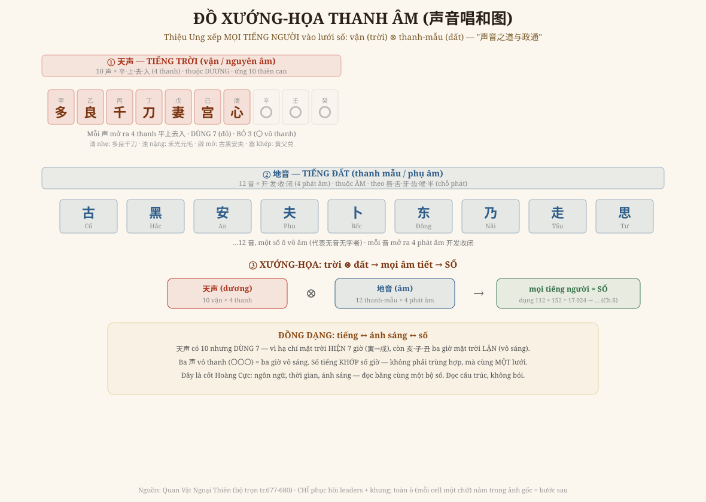

# Chương 11 — Đồ Xướng-Họa Thanh Âm: Tiếng Người Cũng Là Số

### 声音唱和图 · Chương 6 cho SỐ của tiếng — chương này cho cái BẢNG tiếng thật

> *Phục dựng từ Quan Vật Ngoại Thiên (bộ trọn tr.677-680; lời Chúc thị, Hoàng thị). CHỈ phục hồi được leaders + khung — toàn ô nằm trong ảnh gốc. Đọc → hiểu → vẽ lại. Kèm GIỚI HẠN.*

---

## 1. Trả nốt món nợ của Chương 6

Chương 6 dựng **kiến trúc SỐ** của thanh âm (thể-dụng-xướng-họa → 17.024 → 289 triệu) và hẹn rằng **cái bảng tiếng thật** — 声音唱和图 — sẽ làm sau. Chương này trả món nợ đó: dựng **khung của bảng** (phần em đọc được trong text), và nói thẳng phần nào còn nằm trong ảnh.

Cốt lõi: Thiệu Ung muốn **xếp MỌI TIẾNG NGƯỜI vào lưới số**. Tiếng người = **vận** (nguyên âm, phần "trời") ghép với **thanh mẫu** (phụ âm, phần "đất"). Ghép hai nửa lại sinh ra toàn bộ âm tiết — và đếm được bằng số.

## 2. Vẽ lại — đồ xướng-họa thanh âm

**① 天声 — tiếng TRỜI (vận / nguyên âm).** Mười 声, mỗi cái mở ra **bốn thanh 平·上·去·入**, thuộc **dương**, ứng **10 thiên can**. Bảy cái có tiếng — leaders **多·良·千·刀·妻·宫·心** — và **ba cái 〇 vô thanh** (无声无字). Tính chất: *清* (nhẹ: 多良千刀) / *浊* (nặng: 禾光元毛); *辟* (mở miệng: 古黑安夫) / *翕* (khép miệng: 黄父兑).

**② 地音 — tiếng ĐẤT (thanh mẫu / phụ âm).** Mười hai 音, mỗi cái mở ra **bốn phát âm 开·发·收·闭**, thuộc **âm**, xếp theo **chỗ phát**: *唇·舌·牙·齿·喉·半* (môi·lưỡi·răng-hàm·răng·họng·nửa). Leaders đọc được: **古·黑·安·夫·卜·东·乃·走·思**…

**③ Xướng-họa.** 天声 (dương) **⊗** 地音 (âm) → **mọi âm tiết người** → quy về **SỐ** (chính các dụng-số 112 × 152 = 17.024 của Chương 6). Ngôn ngữ, với Thiệu Ung, **không nằm ngoài lưới số của vũ trụ**.

## 3. Mối "đồng dạng" đắt nhất — tiếng, ánh sáng, số cùng một lưới

Đây là chỗ đẹp nhất, và nó **không phải em suy diễn** — chính văn nói rõ (tr.680): vì sao 天声 có **mười** mà chỉ **dùng bảy**?

> *"正音律数 hành tới bảy thì dừng… vì ngày hạ chí, mặt trời **mọc ở Dần, lặn ở Tuất** — bảy giờ có mặt trời; còn **Hợi·Tý·Sửu ba giờ**, mặt trời lặn dưới đất, mắt không thấy gì. Nên ba số ấy không hành."*

Tức: **bảy 声 có tiếng = bảy giờ mặt trời hiện; ba 声 vô thanh (〇〇〇) = ba giờ mặt trời lặn.** Số của **tiếng** khớp số của **giờ sáng** — không phải trùng hợp, mà vì cả hai đọc bằng **cùng một lưới số**.

Đây chính là cốt tủy Hoàng Cực: **ngôn ngữ, thời gian, ánh sáng** — ba thứ tưởng không liên quan — hóa ra **cùng một cấu trúc đếm được**. Đọc được số của cái này là đọc được cái kia. *Đồng dạng.*

## 4. Vì sao chương này khép mạch

- Chương 6 = **số** của tiếng (vì sao 17.024); Chương 11 = **bảng** tiếng (cái grid sinh ra số đó). Hai chương ghép thành **trọn cánh "Luật/tiếng"** của Hoàng Cực.
- Cùng với cánh "Lịch/thời" (Ch1-5) và các đồ-gốc (Ch7-10), bộ sách giờ đã chạm **mọi hệ thống lớn** của Thiệu Ung: số (Hà-Lạc), sinh (gia-nhất-bội), bản đồ (Tiên-Hậu Thiên), thời (Nguyên-Hội-Vận-Thế), tiếng (thanh âm).

Và vẫn một paradigm: **không bói bằng tiếng**, mà thấy tiếng người cũng nằm trong cùng cái lưới đọc được vũ trụ — *"声音之道与政通"* (đạo của tiếng thông với việc đời).

## 5. Ranh giới phải nói thẳng (GIỚI HẠN)

- **Khung bảng** (天声 10 × 平上去入 / 地音 12 × 开发收闭; dương-âm; 清浊辟翕) và **các leaders** (多良千刀妻宫心 + 〇〇〇; 古黑安夫卜东乃走思): đọc được trong text (tr.677-680), chính xác.
- **Toàn ô** — mỗi vận × mỗi thanh điền một chữ cụ thể (cả bảng mấy chục ô) — **nằm trong ảnh scan**, em **chưa trích, không bịa** chữ vào ô.
- **Đối ứng 7 声 với 7 giờ hạ chí**: chính văn nói rõ (tr.680), không phải suy diễn.
- Con số chi tiết (正声/正音, 体-dụng) đã ở **Chương 6**; chương này là phần **bảng/khung** bổ sung.

---

*Chương 11 khép trọn mạch Luật-Lữ. Bộ sách giờ phủ mọi hệ thống lớn của Hoàng Cực. Phần còn lại của Ngoại Thiên (hậu-thiên lý-số 54 tiết, 运数 39 tiết) là khai triển số chi tiết — có thể thành phụ lục về sau.*
