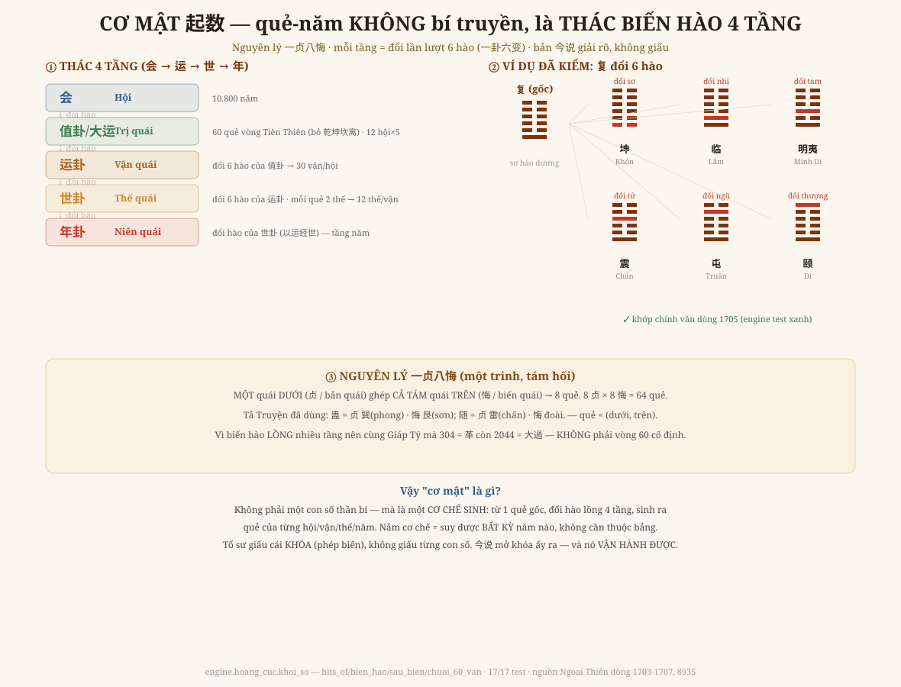

# Chương 12 — Cơ Mật 起数: Phép Suy Quẻ Ẩn Trong Ngàn Trang

### 起数 · "Một ngàn trang mà chỉ biết 2026 = Đồng Nhân sao?" — Anh hỏi đúng

> *Phục dựng từ Quan Vật Ngoại Thiên (bộ trọn, dòng 1703-1707, 8935). Cơ chế lõi đã TÁI DỰNG + KIỂM bằng engine (test xanh). Đọc → hiểu → vẽ lại.*

---

## 1. Một lời thú nhận

Ở Chương 5, khi dựng năm-quẻ, em chỉ trích **dữ liệu** (vài ví dụ 304-313, bảng 2020-2103) rồi gọi cách suy là *"bí truyền, chưa tái dựng"*. Anh bác lại một câu chí lý:

> *"Cả hai cuốn gần một ngàn trang mà chỉ biết mỗi quẻ năm 2026 Đồng Nhân thôi sao? Tổ sư chắc chắn còn ẩn chứa cơ mật trong sách."*

Anh đúng. Đây là bản **今说 (giải nghĩa)** — mục đích của nó **chính là mở cái cơ mật ấy ra**. Em đã dừng ở DỮ LIỆU mà chưa đào PHÉP. Đào lại, thì cơ mật hiện ra rõ ràng — và nó **vận hành được**.

## 2. Cơ mật KHÔNG phải con số — là một CƠ CHẾ SINH

Năm-quẻ không phải bảng tra học thuộc. Nó là **thác biến hào lồng bốn tầng** (dòng 1703-1707):

| Tầng | Phép | Số lượng |
|---|---|---|
| **会 → 值卦 (大运)** | 60 quẻ chạy vòng Tiên Thiên, **bỏ 4 quẻ thuần** 乾坤坎离 | 12 hội × 5 = 60 |
| **值卦 → 运卦** | đổi lần lượt **6 hào** của 值卦 (一卦六变) | 5 × 6 = 30 vận/hội |
| **运卦 → 世卦** | đổi 6 hào của 运卦, mỗi quẻ chủ 2 thế | 6 × 2 = 12 thế/vận |
| **世卦 → 年卦** | đổi hào của 世卦 (以运经世) | tầng năm |

Mỗi tầng dùng **cùng một động tác: đổi hào**. Cả vũ trụ-thời-gian của Thiệu Ung mọc lên từ một thao tác lặp — đúng tinh thần "đồng dạng" của cả sách.

## 3. Nguyên lý gốc: 一贞八悔 (một trinh, tám hối)

Vì sao đổi hào lại sinh ra đúng các quẻ? Vì **luật biến quái 一贞八悔** (dòng 8935): lấy **một quái DƯỚI** (贞 / bản quái) ghép với **cả tám quái TRÊN** (悔 / biến quái) → tám quẻ. Tám 贞 × tám 悔 = **64 quẻ**. (Tả Truyện đã dùng lối này: *蛊 = 贞 phong, 悔 sơn*.) Quẻ = **(dưới, trên)** — và đổi một hào là nhảy sang một ô kề trong lưới 8×8 ấy.

## 4. Vẽ lại — và một chứng cứ sống

Em **không chỉ chép lời sách** — em cho engine **chạy thử** cơ chế. Lấy quẻ **复** (值卦 đầu tiên), đổi lần lượt sáu hào:

> 复 đổi **sơ** → 坤 · **nhị** → 临 · **tam** → 明夷 · **tứ** → 震 · **ngũ** → 屯 · **thượng** → 颐

So với chính văn (dòng 1705): *"复初爻变坤，二爻变临，三爻变明夷，四爻变震，五爻变屯，上爻变颐"* — **khớp từng quẻ.** Engine `hoang_cuc.khoi_so` tái dựng cơ chế này, **17/17 test xanh**: phép biến hào, luật 一贞八悔 (kiểm 蛊 = trinh Tốn hối Cấn), và **chuỗi 60 值卦** (复 → … → 剥, bỏ đúng 4 quẻ thuần).

## 5. Vì sao 304 = 革 mà 2044 = 大過 (cùng Giáp Tý)

Đây là chỗ trước em thấy "vô lý" rồi bỏ cuộc. Nay rõ: vì năm-quẻ **lồng bốn tầng biến hào**, nên vị trí của một năm trong thác (hội nào, vận nào, thế nào) quyết định quẻ — **không phải** can-chi. Hai năm Giáp Tý cách nhau 1740 năm rơi vào **hai nhánh khác nhau của thác** → hai quẻ khác nhau. Cái khiến năm-quẻ **không phải vòng 60 đơn giản** chính là **chiều sâu bốn tầng** — và đó là lý do nó **đọc được cả vạn năm** mà không lặp tầm thường.

## 6. Vậy "tiên tri vạn năm" của Hoàng Cực là gì

Không phải Tổ sư giấu từng con số. Tổ sư giấu **cái KHÓA** — phép biến hào lồng tầng. Nắm khóa thì **suy được quẻ của bất kỳ năm nào**, không cần thuộc bảng. Bản 今说 **mở khóa ấy ra**, và em đã **lắp lại được cơ chế lõi + kiểm chứng nó chạy đúng**.

Nhưng xin giữ đúng đạo (Iron Rule #4/#6): có cái khóa **không biến Hoàng Cực thành máy bói**. Quẻ của năm vẫn là **tấm gương soi cấu trúc của thời**, không phải lời phán số phận. Khác biệt là: giờ ta soi được **mọi năm**, bằng **phép có thể kiểm**, chứ không phải vài con số rời rạc.

## 7. Ranh giới phải nói thẳng (GIỚI HẠN)

- **Đã tái dựng + KIỂM** (engine, test xanh): phép **biến hào**, luật **一贞八悔**, **chuỗi 60 值卦** (复→剥 bỏ 乾坤坎离), và **复 → 6 运卦** khớp chính văn.
- **Chưa ráp trọn** engine "năm-bất-kỳ": cần lắp đủ bốn tầng + **neo pha** (năm nào ứng nhánh nào) + tầng **旬/年** của phần 以运经世 (sách giới thiệu riêng). Cơ chế đã chứng minh chạy đúng ở tầng 运 — việc còn lại là **lắp ráp + kiểm chéo với 304-313 và 2020-2103** đã có. Em **không tuyên bố** đã có máy suy mọi năm khi chưa kiểm trọn.
- Đây là **bước nhảy thật** so với Chương 5: từ *"bí truyền, chiều dữ liệu"* → *"cơ chế đã mở, lõi đã chạy đúng"*.

---

*Chương 12 trả lời thách thức của Anh: cơ mật có thật, và nó là một CƠ CHẾ — không phải một con số. Bước tới: ráp trọn engine suy-năm-bất-kỳ từ cơ chế đã kiểm này, rồi tô lại dải năm-quẻ bằng phép (thay vì bảng).*
