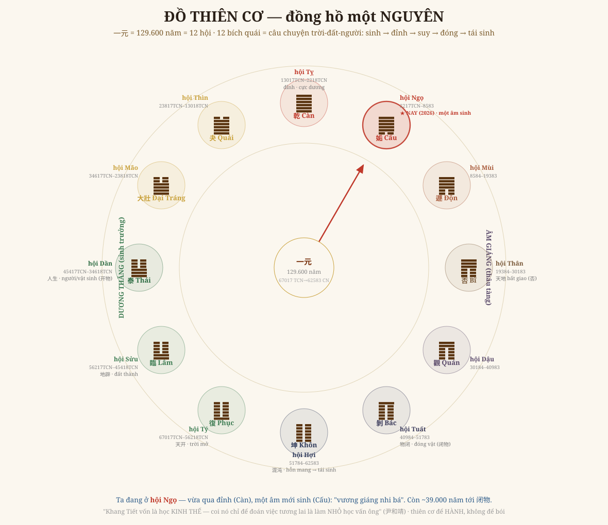

# Chương 13 — Thiên Cơ: Đồng Hồ Lớn Nhất, Từ Trời Mở Đến Trời Đóng

### 天开于子 · 物闭于戌 · Cái khung "trên suy往古, dưới suy tương lai" của Tổ sư

> *Phục dựng từ Quan Vật + tự tự bộ trọn (dòng 1403, 398-428). Số năm thật từ engine (NGUYÊN khởi 67017 TCN). Đọc → hiểu → vẽ lại. Kèm GIỚI HẠN.*

---

## 1. Cái khung lớn nhất

Tất cả các chương trước — số, quẻ, vận, thế, năm — quy về **một cái khung tối cao**. Lời sách (dòng 1403):

> *"天开于子, 地辟于丑, 人生于寅, 物闭于戌." — Bằng một phương pháp rất giản dị, sách trên suy về thái cổ, dưới suy tới tương lai; phàm mọi sự giữa khoảng **trời mở – trời đóng**, không gì chẳng **rõ như trong lòng bàn tay**.*

Đây là **thiên cơ** — không phải bí thuật bói toán, mà là **cái đồng hồ của cả vũ trụ**: một NGUYÊN (一元) = **129.600 năm** = 12 hội, và **12 hội ấy chính là 12 bích quái tiêu-tức** — kể trọn câu chuyện trời-đất-người từ sinh tới diệt tới tái sinh.

## 2. Vẽ lại — Đồ Thiên Cơ

**Đọc vòng đồng hồ** (số năm từ engine, neo 304 CN):

| Hội | Bích quái | Năm | Cơ |
|---|---|---|---|
| **Tý** | 复 (1 dương) | 67017–56218 TCN | **天开 — trời mở** (ánh sáng đầu) |
| Sửu | 临 (2 dương) | …45418 TCN | 地辟 — đất thành |
| **Dần** | 泰 (3 dương, thiên-địa giao) | 45417–34618 TCN | **人生 — người/vật sinh (开物)** |
| Mão·Thìn | 大壮·夬 | …2218 TCN | trưởng thịnh |
| **Tỵ** | 乾 (6 dương) | 13017–2218 TCN | **đỉnh — cực dương** |
| **Ngọ** | 姤 (1 âm) | 2217 TCN–8583 CN | **★ NAY — một âm sinh, bắt đầu suy** |
| Mùi·Thân | 遁·否 | … | lui ẩn · thiên-địa bất giao |
| Dậu | 观 | … | quán chiêm |
| **Tuất** | 剥 (5 âm) | 40984–51783 CN | **物闭 — đóng vật** |
| **Hợi** | 坤 (6 âm) | 51784–62583 CN | **混沌 — hỗn mang, rồi 复 lại mở** |

Cả vũ trụ là **một hơi thở**: dương thăng nửa vòng (trời mở → người sinh → đỉnh), âm giáng nửa vòng (suy → đóng → về không), rồi lại sinh. **Ta đang ở hội Ngọ — vừa qua đỉnh** (cực dương Càn ở hội Tỵ đã qua), **một âm vừa sinh** (Cấu): mùa "vương giáng nhi bá". Loài người sinh ở hội Dần (~45.000 năm trước theo khung này), nay đang ở **buổi chiều** của ngày-vũ-trụ. Còn ~39.000 năm nữa mới tới "đóng vật".

## 3. Tổ sư — Spengler của phương Đông, sớm 800 năm

Điều kinh ngạc: chính bản 今说 **so Thiệu Ung với Spengler** (司宾格勒, *"Suy tàn của phương Tây"*, dòng 398-428). Cả hai thấy **mọi nền văn hóa có xuân-hạ-thu-đông** — sinh ra, rực rỡ, già, rồi tàn; *"không một nền văn hóa nào thoát khỏi vận già cỗi."* Spengler tiên báo phương Tây: đại đô thị, kẻ giàu vung tiền kẻ nghèo đói ăn, tiền mua được cả quyền lực và mỹ sắc, dân chủ mục ruỗng, chiến tranh tàn khốc vô đạo. Sách đối chiếu thẳng với lời Thiệu tử: **"天下将乱, 其人必尚利也"** (thiên hạ sắp loạn, người ắt chuộng lợi). Tổ sư thấy điều ấy **trước Spengler 800 năm** — *"nghe quyên kêu mà biết thiên hạ sắp loạn."*

## 4. Câu then chốt — thiên cơ để HÀNH, không để BÓI

Và đây là lời em xin khắc, vì nó là **chính tuyên ngôn của truyền thống** (尹和靖, dòng 428):

> *"康节本是经世之学, 今人但知其明易之数, 知未来事, 却小了他的学问." — Khang Tiết vốn là học **KINH THẾ** (kinh bang tế thế). Người nay chỉ biết ông 'rõ số Dịch, đoán việc tương lai' — **thế là đã làm NHỎ học vấn của ông.***

Thiên cơ **không phải để đoán việc**, mà để **biết mình ở mùa nào của trời đất mà HÀNH cho hợp** — đó là *kinh thế*. Coi Hoàng Cực là máy bói = phản bội chính Tổ sư. Suốt 13 chương, đây là cốt tủy không đổi (Iron Rule #4/#6/#8): **đọc cấu trúc để hành, không phán số để sợ.**

## 5. Đồng dạng tối hậu — vì sao thiên cơ ĐỌC ĐƯỢC

Cái đồng hồ 12-bích-quái này **không chỉ ở trời**. Cùng một khuôn tiêu-tức ấy hiện ở **mọi tầng, mọi cỡ**:
- một **ngày** (12 giờ: tý dương sinh → ngọ âm sinh),
- một **năm** (12 tháng: đông chí 复 → hạ chí 姤),
- một **đời người** (sinh-trưởng-suy-lão),
- một **nguyên** (129.600 năm).

Một khuôn, lặp ở mọi cỡ — **đó là "đồng dạng"**. Và vì sao tâm người **đọc được** cái khuôn của trời? Vì *"心为太极"* — **tâm cũng là một thái cực**, mang sẵn cùng cái khuôn. Ta đọc được thiên cơ **không phải vì nhìn trộm trời, mà vì ta vốn đồng dạng với trời** (Vận Pháp Thi: *"một thân lại có một trời đất"*). Đó là thiên cơ sâu nhất Tổ sư để lại: **vũ trụ và tâm người cùng một số.**

## 6. Ranh giới phải nói thẳng (GIỚI HẠN)

- **Số năm** (天开 67017 TCN · 人生 ~45.000 TCN · 闭物 ~51.783 CN) là theo **khung số của Thiệu Ung** (neo 304 CN), **KHÔNG phải niên đại khảo cổ**. Đọc như **hình-dạng của chu kỳ** (mùa của trời đất), không phải mốc lịch sử tuyệt đối.
- **Mốc hội-quẻ** (12 bích quái) chắc chắn (đã vào engine). Mốc cosmogenesis (天开/人生/闭物) theo chính văn dòng 1403.
- "Còn ~39.000 năm tới đóng vật" là **cấu trúc của mô hình**, không phải lời tiên tri tận thế. Tinh thần vẫn là **đọc mùa, không đoán ngày**.

---

*Chương 13 mở cái khung lớn nhất — và đóng lại bằng điều mở nhất: thiên cơ không nằm ngoài ta. Đồng hồ của trời cũng đập trong tâm. Đọc nó để sống cho hợp mùa — đó là kinh thế, là cả ý nghĩa "Hoàng Cực Kinh Thế".*