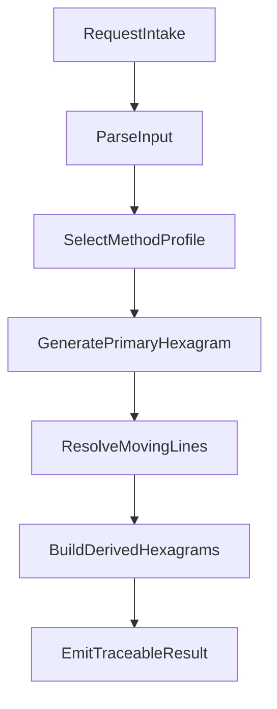

# 03 - Normalized Pipeline Design

## 1. Pipeline Purpose

Design a stable execution pipeline so all methods produce:
- comparable outputs,
- consistent trace records,
- deterministic replay (where method allows).

## 2. Execution Stages

## Stage 0: Request Intake
Input:
- raw user request
- selected method or method-selection policy

Output:
- `RawInvocation`

Validation:
- required top-level fields exist
- unsupported payloads rejected with typed errors

## Stage 1: ParseInput
Normalize request into canonical shape.

Actions:
- parse datetime/timezone/location
- normalize question/context fields
- normalize calendar mode
- sanitize optional metadata

Output:
- `NormalizedRequest`

Trace:
- parser version
- normalization assumptions

## Stage 2: SelectMethodProfile
Resolve actual method profile to run.

Actions:
- direct method match OR policy-driven selection
- check method status (`active`, `experimental`)
- check school constraints

Output:
- `ResolvedMethodProfile`

Trace:
- selection reason
- rejected candidates list

## Stage 3: GeneratePrimaryHexagram
Method-specific generation of 6 base lines.

Actions:
- run method algorithm with normalized input
- build line states in bottom-up order
- map line polarity to primary hexagram identity

Output:
- `PrimaryHexagram`

Trace:
- raw generation events
- seed/random draws or deterministic calculation values

## Stage 4: ResolveMovingLines
Extract moving lines and validate consistency.

Actions:
- compute `moving_lines` from line states
- enforce invariant checks
- attach moving-line policy hints

Output:
- `MovingLineResolution`

Trace:
- line-by-line decision map

## Stage 5: BuildDerivedHexagrams
Generate transformed and optional derived hexagrams.

Actions:
- apply `TransformRule`
- compute transformed hexagram
- compute optional school-specific derived forms (nuclear, etc.)

Output:
- `DerivedHexagrams`

Trace:
- transform rule id/version
- before/after line vector

## Stage 6: EmitTraceableResult
Assemble canonical output payload.

Actions:
- merge primary, moving, derived, metadata, confidence
- attach full trace envelope
- attach source provenance

Output:
- `NormalizedResult`

Trace:
- final checksum for replay validation

## 3. Pipeline Control Flow

## 4. Error Model

Typed errors:
- `InputValidationError`
- `MethodResolutionError`
- `GenerationExecutionError`
- `InvariantViolationError`
- `TransformRuleError`
- `ResultAssemblyError`

Error payload requirements:
- `error_code`
- `stage`
- `message`
- `trace_id`
- `recoverability`: `retryable | non_retryable`

## 5. Trace Schema Requirements

Each stage must append:
- `stage_name`
- `started_at`, `finished_at`
- `inputs_summary`
- `outputs_summary`
- `assumptions`
- `warnings`
- `source_refs`

Trace guarantees:
1. Ordered, append-only steps.
2. No silent defaulting without explicit assumption log.
3. Enough data for deterministic replay where applicable.

## 6. Extension Hooks

Pluggable hooks:
- `pre_stage_hooks`
- `post_stage_hooks`
- `method_custom_steps`
- `school_derived_builder`

Rules:
- hooks cannot mutate historical trace entries,
- hooks must declare deterministic behavior contract.

## 7. Performance and Determinism Targets

- deterministic methods:
  - same normalized input must yield identical `NormalizedResult`.
- stochastic methods:
  - same input + same seed must yield identical replay result.
- trace generation overhead target:
  - keep under agreed budget while preserving forensic detail.

## 8. Compatibility with Current Repo

This pipeline can layer on top of current assets:
- data: `data/seeds/hexagrams_master.json`
- text corpus: `data/seeds/hexagram_texts_ngotatto.json`
- ruleset baseline: `docs/rulesets/bac_phai_v1.md`

No immediate replacement required; can be introduced as versioned engine architecture (`engine_v2` style) while preserving current MVP behavior.
