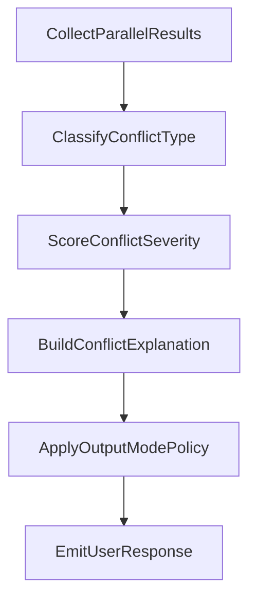

# 05 - Conflict Policy for Multi-School 64-Que Outputs

## 1. Policy Objective

Provide a deterministic framework to handle disagreements across methods/schools without hiding differences or forcing artificial consensus.

## 2. Conflict Types

## 2.1 Generation Conflict
Methods produce different primary/transformed hexagrams from the same context.

Primary causes:
- different method family logic,
- different calendar/time normalization,
- different moving-line rules.

## 2.2 Derivation Conflict
Primary hexagram matches, but transformed/derived forms differ.

Primary causes:
- transform rule variants,
- school-specific derived-hexagram conventions.

## 2.3 Interpretation Conflict
Same generated structure but interpretation policy differs.

Primary causes:
- different line-reading priorities,
- different school doctrine.

## 3. Output Modes

## 3.1 SingleSchoolMode
- one school/method chosen explicitly,
- no cross-school aggregation,
- simplest output for focused users.

Use when:
- practitioner follows one lineage strictly,
- reproducibility within one school is priority.

## 3.2 ParallelSchoolMode
- run multiple active methods in parallel,
- return each result independently with full trace.

Use when:
- user wants comparative view,
- research context requires transparent divergence mapping.

## 3.3 ConsensusHintMode
- run parallel results,
- compute intersection-style hints across methods.

Important:
- consensus hint is advisory, never replaces method-specific outputs.
- disagreement sections must remain visible.

## 4. Conflict Severity Levels

- `low`: minor derivation differences, core structure similar
- `medium`: generated quẻ differ but rationale is well-explained
- `high`: contradictory outputs with limited source confidence or unresolved ambiguity

Severity formula (conceptual):
- weighted by:
  - structural distance,
  - rule divergence depth,
  - source confidence gap.

## 5. Conflict Resolution Workflow

## 6. Required Conflict Payload

When conflict exists, response must include:
- `conflict_type`
- `severity_level`
- `methods_involved`
- `difference_summary`
- `root_cause_explanation`
- `recommended_mode`
- `confidence_impact`

## 7. Recommendation Logic

System recommendation rules:
- if user requested one school explicitly -> recommend `SingleSchoolMode`.
- if user did not specify school and conflict is medium/high -> recommend `ParallelSchoolMode`.
- if methods show stable overlap and user needs actionable summary -> add `ConsensusHintMode`.

## 8. Safety and Transparency Rules

1. Never collapse conflicting outputs into one synthetic result silently.
2. Never hide low-confidence sources when showing consensus hints.
3. Always display method/ruleset ids next to each result.
4. Preserve full trace references for audit.

## 9. Policy for Missing/Weak Sources

If one method has weak provenance:
- keep output available if method is active,
- downgrade source confidence axis,
- annotate that conflict may be source-quality driven.

If source is missing and policy requires strict provenance:
- mark method output as `restricted`,
- exclude from consensus hints by default.

## 10. API-Oriented Contract Additions

Recommended fields:
- `output_mode`
- `conflicts[]`
- `consensus_hints[]`
- `method_results[]`
- `recommended_next_action`

This keeps consumer applications (web/API/reporting) deterministic when rendering multi-method outcomes.
